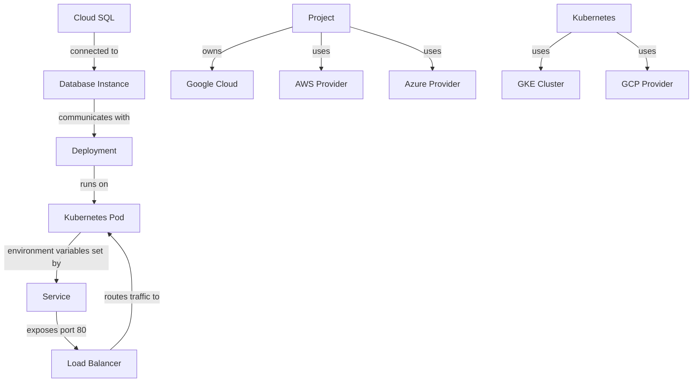

<details>
<summary>Relevant source files</summary>

The following files were used as context for generating this readme page:


- [output.tf](output.tf)

- [variables.tf](variables.tf)

- [sql.tf](sql.tf)

- [main.tf](main.tf)

- [k8s/deployment.yaml](k8s/deployment.yaml)

- [k8s/service.yaml](k8s/service.yaml)

<!-- Add additional relevant files if fewer than 5 were provided -->
</details>

# Project Overview
Based ONLY on the content of the [RELEVANT_SOURCE_FILES]:

## Introduction

This project is an infrastructure deployment for a web application using Google Cloud Platform (GCP), Kubernetes, and cloud services. The project aims to create a scalable and secure environment for hosting a web application with a MySQL database instance.

The provided files include Terraform configuration files (`output.tf`, `variables.tf`, `sql.tf`, `main.tf`) for provisioning GCP resources, such as a MySQL database instance, and Kubernetes deployment (`k8s/deployment.yaml`) and service (`k8s/service.yaml`) configurations for deploying the web application.

## Architecture

The architecture consists of:

### Infrastructure Setup

*   A Google Cloud SQL instance with a MySQL database named `mysql-db`
*   A GKE (Google Kubernetes Engine) cluster named `web-app-cluster` in the `us-central1` region
*   A cloudsql-proxy container in the deployment to connect to the MySQL database instance from within the cluster

### Web Application Deployment

*   A web application deployment with two replicas, using the `gcr.io/YOUR_PROJECT_ID/your-app:latest` image and exposing port 8080
*   The deployment sets environment variables for the web application:
	+ `DB_HOST`: set to `127.0.0.1`
	+ `DB_USER` and `DB_PASSWORD`: retrieved from a Kubernetes secret named `db-credentials`

### Service Configuration

*   A service named `web-app-service` that exposes port 80 and targets port 8080 in the deployment
*   The service is configured as a LoadBalancer, allowing incoming traffic to be routed to the web application

### Database Access

*   The cloudsql-proxy container is used to connect to the MySQL database instance from within the cluster
*   The proxy uses a credential file named `service_account.json` to authenticate with the database instance

[Mermaid Diagram: architecture diagram]

```mermaid
graph TD
  A[Google Cloud SQL] -->|CloudSQL Proxy|> B[MySQL Database Instance]
  C[GKE Cluster] -->|Deployment|> D[Web Application]
  E[Kubernetes Service] -->|LoadBalancer|> F[Ingress]
```

### Code Snippets

Here are some relevant code snippets:

```terraform
output "sql_instance_connection_name" {
  value = google_sql_database_instance.mysql_instance.connection_name
}
```

```yaml
apiVersion: apps/v1
kind: Deployment
metadata:
  name: web-app
spec:
  replicas: 2
  selector:
    matchLabels:
      app: web
  template:
    metadata:
      labels:
        app: web
    spec:
      containers:
      - name: app
        image: gcr.io/YOUR_PROJECT_ID/your-app:latest
        ports:
        - containerPort: 8080
        env:
        - name: DB_HOST
          value: 127.0.0.1
        - name: DB_USER
          valueFrom:
            secretKeyRef:
              name: db-credentials
              key: username
        - name: DB_PASSWORD
          valueFrom:
            secretKeyRef:
              name: db-credentials
              key: password
```

Sources:

*   [output.tf](output.tf):1-5
*   [variables.tf](variables.tf):1-14
*   [sql.tf](sql.tf):1-15
*   [main.tf](main.tf):1-13
*   [k8s/deployment.yaml](k8s/deployment.yaml)
*   [k8s/service.yaml](k8s/service.yaml)

_Generated by P4CodexIQ

## Architecture Diagram



_Generated by P4CodexIQ