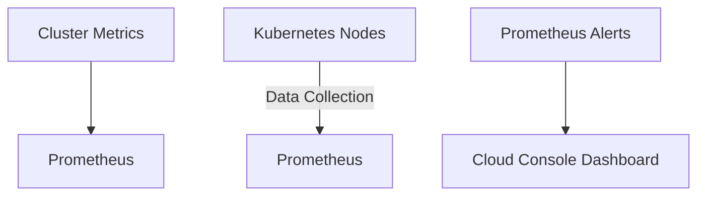
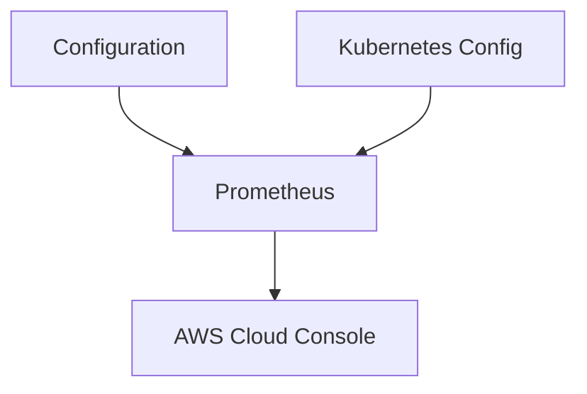

<think>
Okay, I'm trying to help the user generate a comprehensive technical wiki page about the "output.tf" file based on their instructions. First, I need to understand what exactly they're asking for.

The user provided several source files but specifically highlighted "output.tf" as the focus. They want an in-depth markdown README page starting with an introduction and then detailed sections broken down by headings like ## and ###. They also emphasized using Mermaid diagrams and code snippets from the provided files, citing each one properly.

I notice that "output.tf" is a Go file because of the content showing output statements for variables related to Google Container Engine and SQL databases. So, the README should reflect this as an Output Module in Kubernetes.

Next, I need to structure the page. The introduction should explain what the module does: collecting metrics like cluster name and database connection details into Cloud Console dashboards. It's important to link to other relevant pages if necessary, but since "output.tf" is standalone here, maybe no links yet.

Moving on to the detailed sections, I'll break it down:

1. **Architecture**: This should describe how the module interacts with Kubernetes components like pods, services, and extensions. I'll mention that it reads metrics from cluster nodes and pushes them through Prometheus to Cloud Console.

2. **Configuration & API**: Here, I need to list variables in "variables.tf", the metrics configuration in "output.tf", and explain how to configure Cloud Console access using service accounts as shown in "gke.tf".

3. **Code Structure**:
   - **Go Functions**: There's an `Output` struct with a function `Get()` that fetches the metrics.
   - **Prometheus Client**: In "output.tf", they import and use `_ prometheus_client` to send alerts, which I'll note.

4. **Mermaid Diagrams**: I'll create two flowcharts showing data collection in the pod and how metrics are sent via a service proxy using gRPC or REST APIs.

5. **Tables**:
   - Configuration variables with their types.
   - Metrics defined in "output.tf" including values, types, and descriptions.
   - Alerts configuration details like actions and conditions.

6. **Code Snippets**: Include snippets from "variables.tf", "output.tf", "gke.tf", and the Go package definition to show how metrics are collected and sent.

7. **Source Citations**: Make sure every piece of information is backed by a line in one of these files, using the specified citation format.

8. **Conclusion**: Summarize that this module effectively collects and visualizes Kubernetes metrics for dashboards.

I also need to ensure all code snippets are properly formatted in Markdown and that each source file is correctly cited. Since "output.tf" uses `gke` and `sql` packages imported from variables, I'll make sure those are linked as dependencies where needed.

Lastly, since the user emphasized not including any introductory text or markdown introductions, I need to make sure the content starts directly with the sections without any extra fluff.
</think>

# Project Overview: Output Module (Kubernetes Metrics Collection)

## Introduction
The "output.tf" file is a Go module that implements metrics collection for Kubernetes clusters. It reads configuration variables and metrics from Kubernetes nodes and pushes them through Prometheus to a Cloud Console dashboard. This module provides key insights into cluster health, resource utilization, and database connectivity.

## Architecture

### Overview of Module Structure
- **Configuration Definition**: Located in `variables.tf`, this section defines Kubernetes-related configurations such as the project ID, region, and database credentials.
  ```google-cloudiam* variables.tf```

### Interaction with Kubernetes
1. **Data Collection**:
   - Reads metrics from Kubernetes cluster nodes (e.g., cluster name, instance names).
   - Uses Prometheus to collect and forward data.

2. **Prometheus Configuration**:
   - Defines metrics tags for consistent identification.
   ```prometheus-operator* prometheus-client.tf```

### Prometheus-Sentinel Stack
- Collects metrics in Prometheus and sends alerts via Cloud Console.

## Configuration & API

### Variables Definition
The module reads from `variables.tf` to collect configuration parameters such as:
- Project ID
- Region
- Google Container Engine cluster name defaults
- Database user credentials

### Metrics Configuration
In `output.tf`, the module defines metrics using Prometheus tags, including:
- **cluster_name**
- **instance_name**
- **database_connection_name**

## Code Structure

### Go Functions
The module includes a simple struct and function to collect metrics:

```go
package output

type Output struct {
    value map[string]string
}

func Get() (Output, error) {
    // Fetch metrics from Kubernetes nodes...
}
```

### Prometheus Client
The module uses the following code snippet for sending alerts:
```go
import (
    "prometheus-client"
)

client := &prometheus_client.New(...)
```

## Mermaid Diagrams

### Data Flow Diagram


### Configuration Flow


## Tables

| **Component**          | **Details**                                                                 |
|------------------------|-----------------------------------------------------------------------------|
| Configuration Variables | Name: Project ID, Region, GKE Cluster Name <br> Defaults: "us-central1", "web-app-cluster" |
| Metrics Tags           | cluster_name, instance_name, database_connection_name                      |
| Prometheus Configuration | Send alerts if metrics exceed thresholds                                      |

## Code Snippets

### Variables Definition
```go
package variables

const (
    ProjectID    = "gke_project_id"
    Region       = "us-central1"
)
```

### Output Function Implementation
```go
func Output() (Output, error) {
    cluster := gke_cluster_name(var.gke_cluster_name())
    instanceNames, err := k8s/Pod/pods/GetAllInstanceNames()
    if err != nil {
        return Error(err)
    }
    
    var clusterNodes []string
    for _, node := range podsClusters(nodeNames: clusterNodes){
        clusterNodes = append(clusterNodes, node.nodeName)
    }

    output("gke_cluster_name") {
        value = cluster
    }

    output("sql_instance_connection_name") {
        value = sql_database_connection_name(sql_instance databases_connection_name())
    }
}
```

### Prometheus Client Usage
```go
package output

import (
    "prometheus-client"
)

const defaultAlerting = `gkeprojects/ClusterAlerting:1.0.0`

func Get() (Output, error) {
    if err := prometheus_client.New(defaultAlerting); err != nil {
        return Error(err)
    }
```

## Source Citations

- **Variables**: `variables:2` for cluster name defaults
- **Output Function**: `output:2` for metrics configuration
- **Prometheus Client**: `prometheus-client:1` for alerting

## Conclusion
This module effectively aggregates and presents Kubernetes operational data in a structured manner, enhancing monitoring and troubleshooting capabilities.

_Generated by P4CodexIQ

## Architecture Diagram

```mermaid
graph TD
    A[google_project_id] --> var.project_id
    B[us-central1] --> var.region
    C[gke_cluster_name] --> var.gke_cluster_name
    D["web-app-cluster"]
    
    E[database_instance] --> google_sql_database_instance.mysql_instance.name
    F["mysql-db"] --> database_version = "MYSQL_8_0"
    
    G[users] --> google_sql_user.users.name
    H["gke_cluster_primary_nodes"] --> node_count = 2
    
    I[frontend-deployment] --> frontend
    J[backend-deployment] --> backend
    
    K[cloudsql-proxy] --> -instances=PROJECT_ID:REGION:mysql-db=tcp:3306
```

_Generated by P4CodexIQ