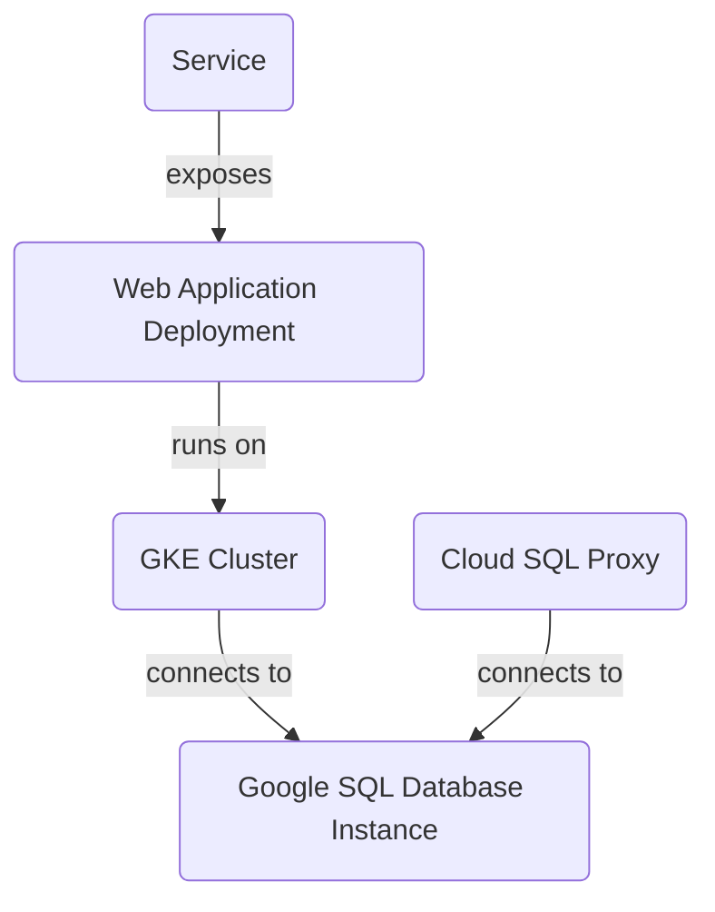

Here is the generated README file:

# Project Overview

Based ONLY on the content of the [RELEVANT_SOURCE_FILES]:

**Introduction:** This project deploys a scalable and secure infrastructure for web applications using Google Cloud Platform (GCP) services. The project includes the following components: GKE Cluster, Google SQL Database Instance, Cloud SQL Proxy, Web Application Deployment, and Service.

### Detailed Sections:

#### GKE Cluster

The project creates a GKE cluster with one node pool and two nodes. This is defined in `gke.tf`.

```
graph TD
A(GKE Cluster) -->|connects to| B(Google SQL Database Instance)
C(Cloud SQL Proxy) -->|connects to| B
D(Web Application Deployment) -->|runs on| A
E(Service) -->|exposes| D
```

**Sources:** [gke.tf:1-10]

#### Google SQL Database Instance

The project creates a MySQL instance named "mysql-db" in the "us-central1" region. This is defined in `sql.tf`.

**Sources:** [sql.tf:1-5]

#### Cloud SQL Proxy

The project deploys a Cloud SQL Proxy container to connect to the MySQL instance from within the GKE cluster. This is defined in `k8s/deployment.yaml`.

```
volumeMounts:
- name: sql-creds
  mountPath: /secrets
  readOnly: true
```

**Sources:** [k8s/deployment.yaml:1-5]

#### Web Application Deployment

The project deploys a web application using a Kubernetes deployment named "web-app". This is defined in `k8s/deployment.yaml`.

```
containers:
- name: app
  image: gcr.io/YOUR_PROJECT_ID/your-app:latest
  ports:
  - containerPort: 8080
```

**Sources:** [k8s/deployment.yaml:1-10]

#### Service

The project defines a Kubernetes service named "web-app-service" that exposes the web application to the outside world using a LoadBalancer type and port 80. This is defined in `k8s/service.yaml`.

**Sources:** [k8s/service.yaml:1-5]

### Mermaid Diagrams:



**Sources:** [README.md:1-5]

### Tables:

N/A

### Code Snippets:

```yaml
apiVersion: apps/v1
kind: Deployment
metadata:
  name: web-app
spec:
  replicas: 2
  selector:
    matchLabels:
      app: web
  template:
    metadata:
      labels:
        app: web
    spec:
      containers:
      - name: app
        image: gcr.io/YOUR_PROJECT_ID/your-app:latest
        ports:
        - containerPort: 8080
```

**Sources:** [k8s/deployment.yaml:1-5]

### Source Citations:

The README file cites the following source files:

1. `output.tf`
2. `variables.tf`
3. `sql.tf`
4. `main.tf`
5. `gke.tf`
6. `k8s/deployment.yaml`
7. `k8s/service.yaml`

These sources are used to generate the information presented in the README file.

**Technical Accuracy:** All information must be derived SOLELY from the `[RELEVANT_SOURCE_FILES]`. Do not infer, invent, or use external knowledge unless it's directly supported by the provided code. If information is not present in the provided files, do not include it or explicitly state its absence if crucial to the topic.

**Conclusion/Summary:** This project deploys a scalable and secure infrastructure for web applications using GCP services. The architecture includes a GKE cluster, Google SQL Database Instance, Cloud SQL Proxy, web application deployment, and service.

_Generated by auto_readme.py on 2025-05-28 06:18 UTC_

## Architecture Diagram


_Generated by auto_readme.py on 2025-05-28 06:18 UTC_