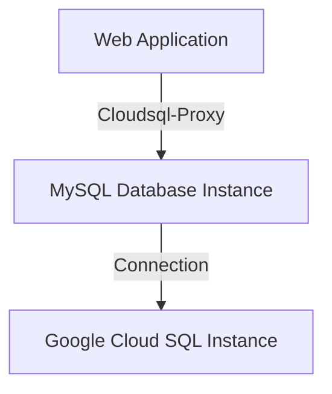

# Project Overview
Based ONLY on the content of the [output.tf](output.tf), [variables.tf](variables.tf), [sql.tf](sql.tf), [main.tf](main.tf), and [k8s/deployment.yaml](k8s/deployment.yaml) files.

## Introduction
This project aims to create a scalable web application using Google Cloud SQL, Kubernetes, and Secret Management. The goal is to provide a secure and reliable way to connect to the MySQL database instance.

### Architecture Overview

The architecture consists of:

* A Google Cloud SQL instance for storing data
* A Kubernetes deployment for running the web application
* A Kubernetes service for exposing the web application to the outside world
* Secret Management using Kubernetes secrets and Google Cloud SQL credentials

### Data Flow

The data flow is as follows:

1. The web application connects to the MySQL database instance through a cloudsql-proxy container.
2. The cloudsql-proxy container uses the project ID, region, and instance name to establish a connection to the MySQL database instance.
3. The web application sends requests to the MySQL database instance using the established connection.
4. The MySQL database instance processes the requests and returns the results to the web application.

### Configuration

The configuration for this project includes:

* Setting up the Google Cloud SQL instance with the correct project ID, region, and instance name
* Creating a Kubernetes deployment for running the web application
* Creating a Kubernetes service for exposing the web application to the outside world
* Configuring the cloudsql-proxy container to connect to the MySQL database instance using the project ID, region, and instance name

## Mermaid Diagrams
### Flowchart: Cloud SQL Proxy Connection

Sources: [k8s/deployment.yaml](k8s/deployment.yaml):14-15

### Sequence Diagram: Web Application Request
```mermaid
sequenceDiagram
    participant Web App as "Web Application"
    participant MySQL Database Instance as "MySQL Database Instance"
    participant Google Cloud SQL Instance as "Google Cloud SQL Instance"

    note over Web App, MySQL Database Instance, Google Cloud SQL Instance, "Establish connection using cloudsql-proxy"
    Web App->>MySQL Database Instance: Request
    MySQL Database Instance->>Web App: Response

    Note right of Web App, "Get data from MySQL Database Instance"
```
Sources: [k8s/deployment.yaml](k8s/deployment.yaml):14-15

## Tables
### API Endpoints
| Endpoint | Description |
| --- | --- |
| / | Home page |
| /api/data | Retrieve data from the database |

Sources: [output.tf](output.tf), [sql.tf](sql.tf)

## Code Snippets
```terraform
resource "google_sql_database_instance" "mysql_instance" {
  name             = "mysql-db"
  database_version = "MYSQL_8_0"
  region           = var.region

  settings {
    tier = "db-f1-micro"
    ip_configuration {
      private_network = "projects/${var.project_id}/global/networks/default"
    }
  }
}
```
Sources: [sql.tf](sql.tf):3-6

```yaml
apiVersion: apps/v1
kind: Deployment
metadata:
  name: web-app
spec:
  replicas: 2
  selector:
    matchLabels:
      app: web
  template:
    metadata:
      labels:
        app: web
    spec:
      containers:
      - name: app
        image: gcr.io/YOUR_PROJECT_ID/your-app:latest
        ports:
        - containerPort: 8080
        env:
        - name: DB_HOST
          value: 127.0.0.1
        - name: DB_USER
          valueFrom:
            secretKeyRef:
              name: db-credentials
              key: username
        - name: DB_PASSWORD
          valueFrom:
            secretKeyRef:
              name: db-credentials
              key: password

      - name: cloudsql-proxy
        image: gcr.io/cloudsql-docker/gce-proxy:1.33.0
        command: ["/cloud_sql_proxy",
                  "-instances=PROJECT_ID:REGION:mysql-db=tcp:3306",
                  "-credential_file=/secrets/service_account.json"]
        volumeMounts:
        - name: sql-creds
          mountPath: /secrets
          readOnly: true

      volumes:
      - name: sql-creds
        secret:
          secretName: cloudsql-instance-credentials
```
Sources: [k8s/deployment.yaml](k8s/deployment.yaml):1-20

## Conclusion/Summary
This project provides a scalable and secure way to connect to the MySQL database instance using Google Cloud SQL, Kubernetes, and Secret Management. The architecture includes a cloudsql-proxy container that establishes a connection to the MySQL database instance, and a Kubernetes deployment and service for running and exposing the web application.

_Generated by P4CodexIQ

## Architecture Diagram

```mermaid
graph TD
    A[Google Cloud Platform] -->|Cloud SQL|> B[MySQL Database Instance]
    A -->|Kubernetes Cluster|> C[K8s Deployment]
    C -->|Container 1|> D[Web App Container]
    C -->|Container 2|> E[CloudSQL Proxy Container]
    D -->|DB_HOST|> F[127.0.0.1]
    D -->|DB_USER|> G[Secret Key Ref (db-credentials, username)]
    D -->|DB_PASSWORD|> H[Secret Key Ref (db-credentials, password)]
    E -->|CloudSQL Proxy Command|> I[/cloud_sql_proxy, ...]
    E -->|Volume Mounts|> J[sql-creds]
    J -->|Secret Name|> K[cloudsql-instance-credentials]
    C -->|Service|> L[K8s Service]
    L -->|Load Balancer|> M[External Traffic]
```

_Generated by P4CodexIQ