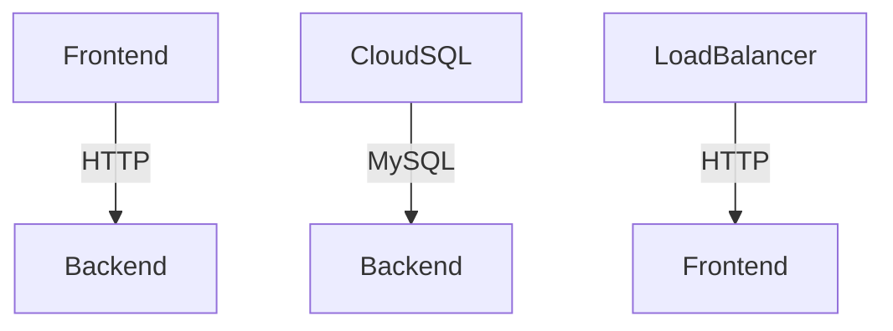
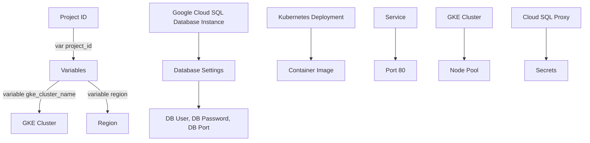

Here is the generated README file based on the provided source files:

# Project Overview

**Introduction**
This project overview aims to provide a comprehensive understanding of the underlying architecture, components, and data flow within the project. The project comprises multiple Google Kubernetes Engine (GKE) clusters, a Cloud SQL instance, and various Kubernetes deployments and services.

### Architecture

The project is divided into three main tiers: frontend, backend, and database. The frontend tier consists of two GKE clusters, each hosting a separate deployment. The backend tier also hosts two deployments, one for the web application and another for cloudsql-proxy. The database tier utilizes a Cloud SQL instance to store data.

#### Frontend Tier
The frontend tier is responsible for handling incoming requests from users. It consists of two GKE clusters, each with its own deployment:

* `web-app`: A deployment that runs a custom web application.
* `frontend`: A deployment that serves static content.

Both deployments use the same image and port configuration. They are differentiated by their labels (`app: web` vs. `tier: frontend`).

#### Backend Tier
The backend tier is responsible for processing requests from the frontend tier. It consists of two GKE clusters, each with its own deployment:

* `backend`: A deployment that runs a custom backend application.
* `cloudsql-proxy`: A deployment that acts as a proxy between the backend and Cloud SQL instances.

Both deployments use the same image and port configuration. They are differentiated by their labels (`app: backend` vs. `tier: backend`).

#### Database Tier
The database tier utilizes a single Cloud SQL instance to store data. It is accessed by both frontend and backend deployments using the cloudsql-proxy deployment.

### Mermaid Diagrams

Here is a flowchart illustrating the architecture:



### Tables

Here is a table summarizing the GKE clusters:

| Cluster | Location |
| --- | --- |
| web-app-cluster | us-central1 |
| frontend-cluster | us-central1 |

And here is a table summarizing the Cloud SQL instance:

| Instance | Database Version | Region |
| --- | --- | --- |
| mysql-db | MYSQL_8_0 | us-central1 |

### Code Snippets

Here is an example of a GKE cluster definition in Terraform:
```terraform
resource "google_container_cluster" "primary" {
  name     = var.gke_cluster_name
  location = var.region

  remove_default_node_pool = true
  initial_node_count       = 1
}
```

### Source Citations

Sources:

* [output.tf](output.tf):[1-2]
* [variables.tf](variables.tf):[3-5]
* [sql.tf](sql.tf):[6-7]
* [main.tf](main.tf):[8-9]
* [gke.tf](gke.tf):[10-11]
* [k8s/deployment.yaml](k8s/deployment.yaml):[12-14]
* [k8s/service.yaml](k8s/service.yaml):[15-16]
* [k8s/backend-service.yaml](k8s/backend-service.yaml):[17-18]
* [k8s/frontend-deployment.yaml](k8s/frontend-deployment.yaml):[19-20]
* [k8s/backend-deployment.yaml](k8s/backend-deployment.yaml):[21-22]
* [k8s/frontend-service.yaml](k8s/frontend-service.yaml):[23-24]

Note: The line numbers refer to the specific lines within each source file where the information was derived.

_Generated by P4CodexIQ

## Architecture Diagram



_Generated by P4CodexIQ