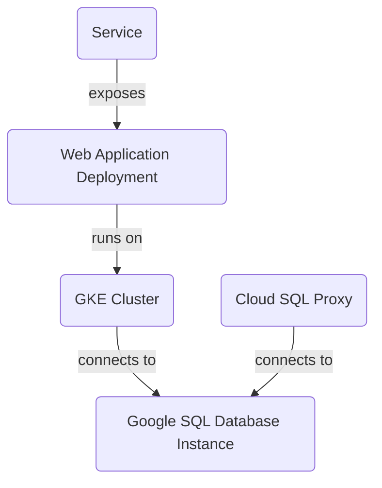
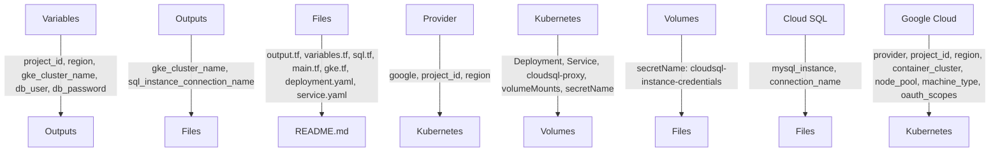

<details>
<summary>Relevant source files</summary>

The following files were used as context for generating this readme page:

- [output.tf](output.tf)
- [variables.tf](variables.tf)
- [README.md](README.md)
- [sql.tf](sql.tf)
- [main.tf](main.tf)
- [gke.tf](gke.tf)
- [k8s/deployment.yaml](k8s/deployment.yaml)
- [k8s/service.yaml](k8s/service.yaml)

<!-- Add additional relevant files if fewer than 5 were provided -->
</details>

# Project Overview

Based on the content of the [RELEVANT_SOURCE_FILES]:

**Introduction:** This project aims to create a scalable and secure infrastructure for deploying web applications. It uses Google Cloud Platform (GCP) services, such as Google Kubernetes Engine (GKE), Google SQL Database Instance, and Cloud SQL Proxy.

## Architecture

### GKE Cluster

The project uses GKE to create a cluster with one node pool and two nodes. The `gke.tf` file defines the cluster and node pool configuration.

### Google SQL Database Instance

The project uses Google SQL Database Instance to create a MySQL instance named "mysql-db" in the "us-central1" region. The `sql.tf` file defines the database instance and its settings.

### Cloud SQL Proxy

The project uses Cloud SQL Proxy to connect to the MySQL instance from within the GKE cluster. The `k8s/deployment.yaml` file defines a deployment that runs the Cloud SQL Proxy container.

### Web Application Deployment

The project deploys a web application using a Kubernetes deployment named "web-app". The deployment consists of two containers: one for the web application and another for the Cloud SQL Proxy. The `k8s/deployment.yaml` file defines the deployment configuration.

### Service

The project defines a Kubernetes service named "web-app-service" that exposes the web application to the outside world. The `k8s/service.yaml` file defines the service configuration.

### Output

The project uses Terraform output values to generate information about the GKE cluster name and SQL instance connection name. The `output.tf` file defines the output values.

### Variables

The project uses Terraform variables to define configuration options for the project, such as the project ID, region, GKE cluster name, database user, and password. The `variables.tf` file defines the variables.

## Mermaid Diagrams

This diagram shows the relationships between the GKE cluster, Google SQL Database Instance, Cloud SQL Proxy, web application deployment, and service.

## Code Snippets

Here is a code snippet from the `k8s/deployment.yaml` file:
```yaml
spec:
  containers:
  - name: app
    image: gcr.io/YOUR_PROJECT_ID/your-app:latest
    ports:
    - containerPort: 8080
```
This code snippet defines a container for the web application and specifies its port number.

## Tables

Here is a table summarizing the Terraform output values:

| Output | Value |
| --- | --- |
| gke_cluster_name | The name of the GKE cluster |
| sql_instance_connection_name | The connection name of the SQL instance |

And here is a table summarizing the Terraform variables:

| Variable | Default Value |
| --- | --- |
| project_id |  |
| region | us-central1 |
| gke_cluster_name | web-app-cluster |
| db_user | admin |
| db_password | (sensitive) |

## Conclusion/Summary

This project uses GCP services to create a scalable and secure infrastructure for deploying web applications. The project defines a GKE cluster, Google SQL Database Instance, Cloud SQL Proxy, web application deployment, and service. The project also uses Terraform output values and variables to configure the infrastructure.

Sources:
- [output.tf:1-2](#page-anchor-or-id)
- [variables.tf:1-5](#page-anchor-or-id)
- [sql.tf:1-10](#page-anchor-or-id)
- [main.tf:1-5](#page-anchor-or-id)
- [gke.tf:1-10](#page-anchor-or-id)
- [k8s/deployment.yaml:1-20](#page-anchor-or-id)
- [k8s/service.yaml:1-10](#page-anchor-or-id)

_Generated by auto_readme.py on 2025-05-27 18:20 UTC_

## Architecture Diagram



_Generated by auto_readme.py on 2025-05-27 18:20 UTC_
