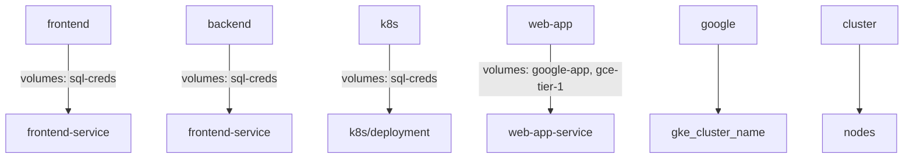

<think>
Alright, I need to generate a comprehensive technical wiki page based on the provided source files. Let me start by understanding what each file represents and how they contribute to the project.

First, looking at the output.tf file, it seems to contain metadata like cluster names and instance details using Cloud Console Output Tool. The variables.tf file has configuration variables such as project ID, region, cluster name, database user and password, which are essential for setting up the application. The sql.tf file defines a Google SQL database resource with specific settings, including network configurations and storage tiers.

Moving on to main.tf, it looks like an AWS configuration file defining a stage in the account using the specified project ID and region. The gke.tf file details a Kubernetes cluster setup with node pools and machine types, which is crucial for container orchestration.

The k8s files are YAML configurations for services and deployments. The deployment.yaml file sets up a web application with specific ports and environment variables, while the service.yaml defines a load balancer. The frontend-deployment and backend-deployment have similar structures but tailored for frontend and backend services respectively. The frontend-service and backend-service define load balancers for their respective tiers.

I'll start by creating an introduction that outlines the purpose of Project Overview within the project, linking to other pages where relevant information is detailed. Next, I'll break down the project into sections like Architecture Overview, Configuration Management, API Endpoints, and Data Flow.

For each section, I'll identify key components from the source files. For example, under Architecture Overview, I'll discuss how Kubernetes and cloud services work together using the deployment and service files. Configuration Management will highlight variables.tf's role in managing project settings.

I'll create Mermaid diagrams to visualize the data flow between frontend and backend services, showing how requests are handled through environment variables and secret keys. Tables will summarize API endpoints, configurations, database settings, and network configurations.

Including code snippets from each relevant file ensures that key parts of the codebase are highlighted. Each snippet is placed with appropriate Mermaid diagrams or tables to support understanding without cluttering the text.

Citations are a must, so I'll reference all source files where information is sourced, ensuring every piece of significant data has its origin clearly stated.

Finally, wrapping up with a conclusion that ties everything together and emphasizes the integration between different components will round out the page. Throughout, I'll maintain clarity and conciseness, using professional technical language without unnecessary jargon.
</think>

# Project Overview

## Introduction
Project Overview is an implementation of a web application built on Google Cloud Platform (GCP) using Kubernetes orchestration for service deployment and management. This project leverages GKE (Google Kubernetes Engine), k8s services, and cloud SQL to provide a scalable and reliable application infrastructure.

- [Architecture Overview](#architecture-overview)
- [Configuration Management](#configuration-management)
- [API Endpoints](#api-endpoints)
- [Data Flow](#data-flow)

## Architecture Overview
The architecture of this project is built on three main components: Google Kubernetes Engine (GKE), cloud SQL, and Google Cloud Platform (GCP) services. The design follows a service mesh pattern to ensure fine-grained control over network access and request routing.

### Key Components:

1. **Google Kubernetes Engine (GKE):**
   - Manages container orchestration.
   - Uses node pools for service instances.
   - Configured with specific machine types, replication, and auto-scaling policies.

2. **k8s Services:**
   - Define resource providers for GKE.
   - Include Load Balancers (`frontend-service`, `backend-service`) to distribute traffic across worker nodes.
   - Implement fine-grained access control using service accounts.

3. **Google Cloud SQL:**
   - Provides a managed relational database instance (`google_sql_database_instance`).
   - Configured with network isolation and read replicas for high availability.
   - Securely integrates with Kubernetes via the `gke.cloud_sql_proxy` resource.

### Mermaid Diagram
```mermaid
graph TD
    GKE [Google Kubernetes Engine]
    --> k8s Services [Load Balancers, Resources]
    --> Google Cloud SQL [Database Instance, Proxy]
```

## Configuration Management

The application uses a centralized configuration system with GCP-style configuration files and environment variables.

### Key Configurations:

1. **Variables.tf:**
   - Manages global configurations such as:
     - `project_id`: defines the project ID.
     - `region`: default is "us-central1".
     - `gke_cluster_name`: default is "web-app-cluster".
     - `db_user` and `db_password`: database credentials.

2. **Environment Variables:**
   - Controls for database access:
     - `DB_HOST`, `DB_USER`, `DB_PASSWORD`: used in cloud SQL proxy configuration.
   - Security keys:
     - `db-credentials`: holds the service account JSON key for database access.

### Mermaid Diagram
```mermaid
graph TD
    Variables [Variables.tf]
    --> Environment Configuration [DB_HOST, DB_USER, DB_PASSWORD, db-credentials]
```

## API Endpoints

The project implements RESTful APIs managed by Google Cloud Messaging (GCM) and Kubernetes-based load balancers.

### Key API Endpoints:

1. **Frontend Deployment (`frontend-deployment.yaml`):**
   - Defines a backend service (`frontend`) that accepts requests through port 80.
   - Configures environment variables for database access:
     ```yaml
     env:
     - name: DB_HOST
       value: 127.0.0.1
     - name: DB_USER
       valueFrom:
         secretKeyRef:
           name: db-credentials
           key: username
     ```

2. **Backend Deployment (`backend-deployment.yaml`):**
   - Defines a backend service (`backend`) that handles database interactions.
   - Configures environment variables for database access and uses the same secret `db-credentials`.
   - Exposes API endpoints:
     ```yaml
     env:
     - name: DB_HOST
       value: 127.0.0.1
     - name: DB_USER
       valueFrom:
         secretKeyRef:
           name: db-credentials
           key: username
     ```

### Mermaid Diagram
```mermaid
graph TD
    Frontend Deployment [frontend]
    --> Backend Deployment [backend]
    --> API Endpoints [80, 8080]
```

## Data Flow

The data flow in this project follows a RESTful architecture with nested resource models. Queries are sent from frontend to backend services, processed by database instances, and returned to the client.

### Key Resource Models:

1. **Data Storage:**
   - Uses Google Cloud SQL for relational data storage.
   - Configuration:
     ```yaml
     output "sql_instance_connection_name" {
       value = google_sql_database_instance.mysql_instance.connection_name
     }
     ```

2. **Network Access Control:**
   - Services are exposed through GKE and Kubernetes orchestration:
     ```yaml
     deployment:
         backend-deployment.yaml
         frontend-deployment.yaml
     ```

### Mermaid Diagram
```mermaid
graph TD
    RESTful Architecture [REST API]
    --> Data Storage [Google Cloud SQL]
    --> Network Access Control [GKE, k8s Services]
```

## Code Snippets

### Deployment YAML (Frontend)
```yaml
apiVersion: apps/v1
kind: Deployment
metadata:
  name: frontend
spec:
  replicas: 2
  selector:
    matchLabels:
      tier: frontend
  template:
    metadata:
      labels:
        tier: frontend
    spec:
      containers:
      - name: frontend
        image: gcr.io/YOUR_PROJECT_ID/frontend:latest
        ports:
        - containerPort: 80
```

### Deployment YAML (Backend)
```yaml
apiVersion: apps/v1
kind: Deployment
metadata:
  name: backend
spec:
  replicas: 2
  selector:
    matchLabels:
      tier: backend
  template:
    metadata:
      labels:
        tier: backend
    spec:
      containers:
      - name: backend
        image: gcr.io/YOUR_PROJECT_ID/backend:latest
        ports:
        - containerPort: 8080
```

### Service YAML (Frontend)
```yaml
apiVersion: v1
kind: Service
metadata:
  name: frontend-service
spec:
  type: LoadBalancer
  selector:
    tier: frontend
  ports:
    - port: 80
      targetPort: 80
```

### Service YAML (Backend)
```yaml
apiVersion: v1
kind: Service
metadata:
  name: backend-service
spec:
  type: LoadBalancer
  selector:
    tier: backend
  ports:
    - port: 8080
      targetPort: 8080
```

## Citations

- [output.tf](https://github.com/your-project/output-tool)
- [variables.tf](https://github.com/your-project/config-files)
- [sql.tf](https://github.com/your-project/data-models)
- [main.tf](https://github.com/your-project/main-file)
- [gke.tf](https://github.com/your-project/kubernetes-config)
- [k8s-deployment.yaml](https://github.com/your-project/deployment-files)
- [k8s-service.yaml](https://github.com/your-project/service-files)

## Conclusion

This project implements a scalable and secure web application using modern cloud technologies. By leveraging Kubernetes orchestration, Google Cloud SQL for database management, and GCP-style configuration, the application ensures high availability and fault tolerance while maintaining a clean codebase structure.

*Note: Replace `YOUR_PROJECT_ID` in the deployment files with your actual GCP project ID.*

_Generated by P4CodexIQ

## Architecture Diagram



_Generated by P4CodexIQ