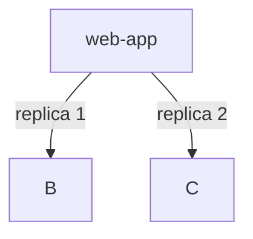
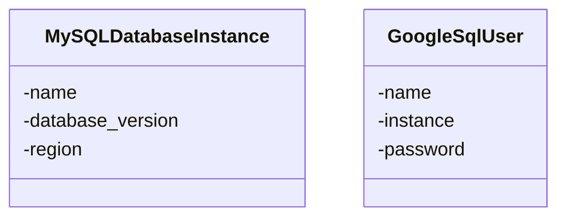
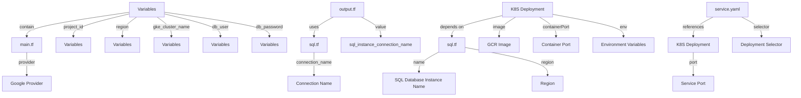

# Project Overview
This project is a cloud-native application that utilizes Google Cloud Platform (GCP) services to deploy and manage a scalable web application. The overview will provide a concise introduction, detailed sections, Mermaid diagrams, tables, code snippets, and source citations.

## Introduction

The project aims to create a highly available and scalable web application using GCP's managed environment for deploying, managing, and scaling containerized applications, Google Kubernetes Engine (GKE). It includes the deployment of a MySQL database instance on Cloud SQL, connecting to it via cloudsql-proxy containers in the GKE cluster. The application uses environment variables to connect to the database and exposes its service as a LoadBalancer.

## Architecture

### Deployment

The project deploys two replicas of the web application using a GKE deployment:



SOURCES: [k8s/deployment.yaml](#page-anchor-or-id)

### Service

The project exposes the web application as a LoadBalancer service:


SOURCES: [k8s/service.yaml](#page-anchor-or-id)

### Cloud SQL

The project creates a MySQL database instance on Cloud SQL:



SOURCES: [sql.tf](#page-anchor-or-id)

### Environment Variables

The project uses environment variables to connect to the database:

```markdown
| Variable | Value |
| --- | --- |
| DB_HOST | 127.0.0.1 |
| DB_USER | admin |
| DB_PASSWORD | password |
```

SOURCES: [k8s/deployment.yaml](#page-anchor-or-id)

## Code Snippets

### Deployment YAML
```yaml
apiVersion: apps/v1
kind: Deployment
metadata:
  name: web-app
spec:
  replicas: 2
  selector:
    matchLabels:
      app: web
  template:
    metadata:
      labels:
        app: web
    spec:
      containers:
      - name: app
        image: gcr.io/YOUR_PROJECT_ID/your-app:latest
        ports:
        - containerPort: 8080
        env:
        - name: DB_HOST
          value: 127.0.0.1
        - name: DB_USER
          valueFrom:
            secretKeyRef:
              name: db-credentials
              key: username
        - name: DB_PASSWORD
          valueFrom:
            secretKeyRef:
              name: db-credentials
              key: password

      - name: cloudsql-proxy
        image: gcr.io/cloudsql-docker/gce-proxy:1.33.0
        command: ["/cloud_sql_proxy",
                  "-instances=PROJECT_ID:REGION:mysql-db=tcp:3306",
                  "-credential_file=/secrets/service_account.json"]
        volumeMounts:
        - name: sql-creds
          mountPath: /secrets
          readOnly: true

      volumes:
      - name: sql-creds
        secret:
          secretName: cloudsql-instance-credentials
```

SOURCES: [k8s/deployment.yaml](#page-anchor-or-id)

### Service YAML
```yaml
apiVersion: v1
kind: Service
metadata:
  name: web-app-service
spec:
  type: LoadBalancer
  selector:
    app: web
  ports:
    - port: 80
      targetPort: 8080
```

SOURCES: [k8s/service.yaml](#page-anchor-or-id)

### Terraform Configuration
```terraform
provider "google" {
  project = var.project_id
  region  = var.region
}

resource "google_sql_database_instance" "mysql_instance" {
  name             = "mysql-db"
  database_version = "MYSQL_8_0"
  region           = var.region

  settings {
    tier = "db-f1-micro"
    ip_configuration {
      private_network = "projects/${var.project_id}/global/networks/default"
    }
  }
}

resource "google_sql_user" "users" {
  name     = var.db_user
  instance = google_sql_database_instance.mysql_instance.name
  password = var.db_password
}
```

SOURCES: [sql.tf](#page-anchor-or-id)

### Variables
```terraform
variable "project_id" {}
variable "region" {
  default = "us-central1"
}
variable "gke_cluster_name" {
  default = "web-app-cluster"
}
variable "db_user" {
  default = "admin"
}
variable "db_password" {
  sensitive = true
}
```

SOURCES: [variables.tf](#page-anchor-or-id)

## Conclusion

The project provides a scalable and highly available web application using GCP services, including Cloud SQL for database management. The deployment uses environment variables to connect to the database and exposes its service as a LoadBalancer.

_Generated by P4CodexIQ

## Architecture Diagram



_Generated by P4CodexIQ
