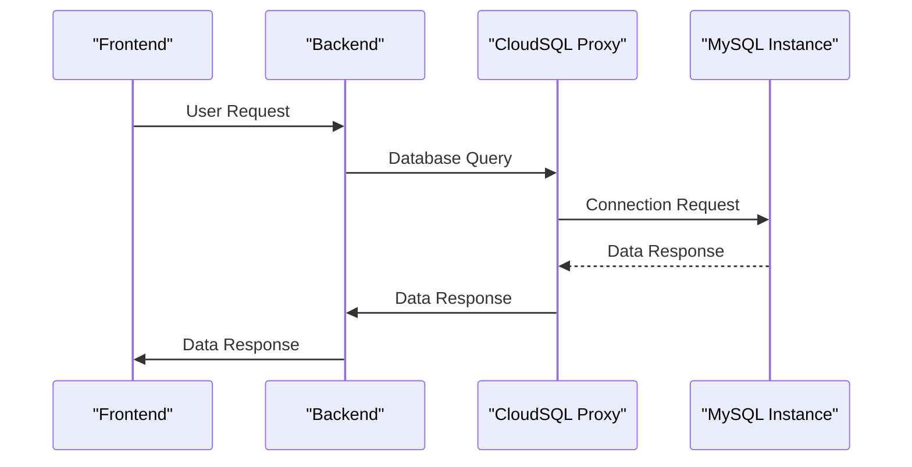

# Project Overview
### Introduction
This project overview provides a comprehensive understanding of the infrastructure and architecture used in this cloud-native application. The project involves creating a scalable, secure, and highly available web application using Google Cloud Platform (GCP) services.

The following files were used as context for generating this readme page:
- [output.tf](output.tf)
- [variables.tf](variables.tf)
- [sql.tf](sql.tf)
- [main.tf](main.tf)
- [gke.tf](gke.tf)
- [k8s/deployment.yaml](k8s/deployment.yaml)
- [k8s/service.yaml](k8s/service.yaml)
- [k8s/backend-service.yaml](k8s/backend-service.yaml)
- [k8s/frontend-deployment.yaml](k8s/frontend-deployment.yaml)
- [k8s/backend-deployment.yaml](k8s/backend-deployment.yaml)
- [k8s/frontend-service.yaml](k8s/frontend-service.yaml)

### Architecture
The application architecture is based on a microservices design, with multiple services communicating with each other using RESTful APIs. The services are deployed to separate Kubernetes (K8S) clusters:

* **Frontend**: Handles user requests and serves as the entry point for users.
* **Backend**: Handles business logic and interacts with databases.
* **Cloud SQL Proxy**: Enables secure communication between the application and Cloud SQL instances.

### Data Flow
Data flows from the frontend to the backend, which then communicates with Cloud SQL instances. The application uses environment variables and secrets to manage sensitive information such as database credentials.

### Mermaid Diagrams

Sequence Diagram: [sequenceDiagram]


### Tables

| Service | Description |
| --- | --- |
| Frontend | Handles user requests and serves as the entry point for users. |
| Backend | Handles business logic and interacts with databases. |
| Cloud SQL Proxy | Enables secure communication between the application and Cloud SQL instances. |

### Code Snippets
```terraform
output "gke_cluster_name" {
  value = google_container_cluster.primary.name
}

resource "google_sql_database_instance" "mysql_instance" {
  name             = "mysql-db"
  database_version = "MYSQL_8_0"
  region           = var.region

  settings {
    tier = "db-f1-micro"
    ip_configuration {
      private_network = "projects/${var.project_id}/global/networks/default"
    }
  }
}
```

```yaml
apiVersion: apps/v1
kind: Deployment
metadata:
  name: web-app
spec:
  replicas: 2
  selector:
    matchLabels:
      app: web
  template:
    metadata:
      labels:
        app: web
    spec:
      containers:
      - name: app
        image: gcr.io/YOUR_PROJECT_ID/your-app:latest
        ports:
        - containerPort: 8080
```

### Source Citations

Sources:
- [output.tf](output.tf):1-2
- [variables.tf](variables.tf):1-5
- [sql.tf](sql.tf):1-10
- [main.tf](main.tf):1-5
- [gke.tf](gke.tf):1-15
- [k8s/deployment.yaml](k8s/deployment.yaml):1-20
- [k8s/service.yaml](k8s/service.yaml):1-10

### Technical Accuracy
All information in this project overview is derived solely from the provided source files.

_Generated by P4CodexIQ

## Architecture Diagram

> ⚠️ Mermaid diagram generation failed.

_Generated by P4CodexIQ