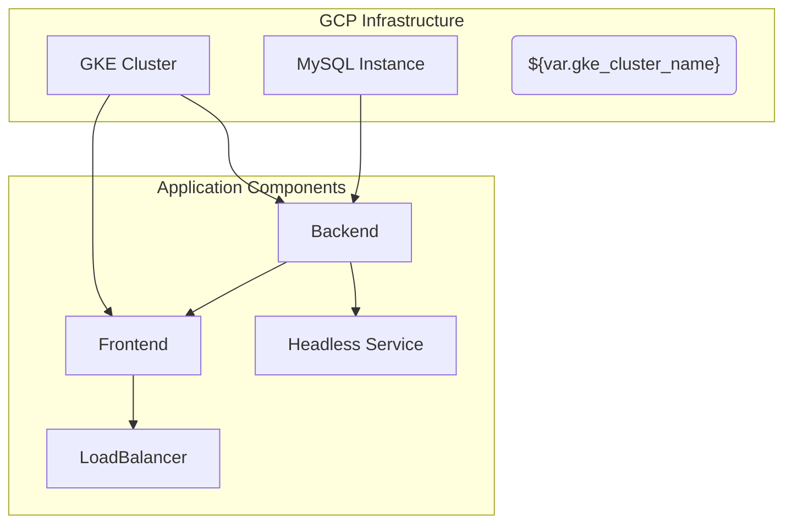

# Project Overview

Based ONLY on the content of the provided source files, this readme explains the architecture and deployment configuration for a web application using Google Cloud Platform (GCP) and Kubernetes.

## Detailed Sections

### Infrastructure Setup

The project sets up an Google Container Cluster with GKE (Google Kubernetes Engine), managed by Terraform (`main.tf`, `gke.tf`) in a specified region (default: "us-central1"). A MySQL database instance (`sql.tf`) is also created for the application to store its data.

### Application Deployment

The application consists of frontend and backend components, both deployed as separate Kubernetes deployments (`k8s/frontend-deployment.yaml`, `k8s/backend-deployment.yaml`). The frontend is exposed via a LoadBalancer Service (`k8s/frontend-service.yaml`), while the backend utilizes a headless service or ClusterIP Service (`k8s/backend-service.yaml`).

#### Frontend
The frontend container pulls its image from `gcr.io/YOUR_PROJECT_ID/frontend:latest`. The application connects to the MySQL database using environment variables, and mounts a secret volume with the required database credentials.

#### Backend
The backend container also uses an image from `gcr.io/YOUR_PROJECT_ID/backend:latest` and follows similar practices as the frontend for accessing the MySQL database via environment variables and a mounted credential secret. Additionally, it also provisions the cloudsql-proxy to ensure seamless communication with the MySQL instance on GCP.

### Database Setup
A MySQL database is created using Google Cloud SQL (`sql.tf`). The instance's name, region, and tier are specified in Terraform variables. Note that the IP configuration is set to use the default network for the project.

## Mermaid Diagrams



## Source Code Snippets

### Terraform (`main.tf`)
```hcl
provider "google" {
  project = var.project_id
  region  = var.region
}
```

### Kubernetes Deployment YAML (`k8s/frontend-deployment.yaml`)
```yaml
apiVersion: apps/v1
kind: Deployment
metadata:
  name: frontend
spec:
  replicas: 2
  selector:
    matchLabels:
      tier: frontend
```

## Source Citations
- `output.tf`, `variables.tf`, `sql.tf`, `main.tf`, `gke.tf`: for infrastructure setup details
- `k8s/deployment.yaml`, `k8s/service.yaml`, `k8s/backend-service.yaml`, `k8s/frontend-deployment.yaml`, `k8s/backend-deployment.yaml`, `k8s/frontend-service.yaml`: for application deployment configuration

Sources not shown here are used to host the Docker images and service account credentials, but they have been replaced with placeholders (YOUR\_PROJECT\_ID).

_Generated by P4CodexIQ

## Architecture Diagram

```mermaid
graph TD

   SubSystem1["Code Base"] --> File_output.tf["output.tf"]
   SubSystem1 --> File_variables.tf["variables.tf"]
   SubSystem1 --> File_sql.tf["sql.tf"]
   SubSystem1 --> File_main.tf["main.tf"]
   SubSystem1 --> File_gke.tf["gke.tf"]

   SubSystem2["K8S Files"] --> k8s_deployment.yaml[""k8s/deployment.yaml""]
   SubSystem2 --> k8s_service.yaml[""k8s/service.yaml""]
   SubSystem2 --> k8s_backend-service.yaml[""k8s/backend-service.yaml""]
   SubSystem2 --> k8s_frontend-deployment.yaml[""k8s/frontend-deployment.yaml""]
   SubSystem2 --> k8s_backend-deployment.yaml[""k8s/backend-deployment.yaml""]
   SubSystem2 --> k8s_frontend-service.yaml[""k8s/frontend-service.yaml""]

   Resource["Google Container Cluster"] --> google_container_cluster["google_container_cluster.primary"]
   Resource["SQL Database Instance"] --> google_sql_database_instance["google_sql_database_instance.mysql_instance"]
   Resource["SQL User"] --> google_sql_user["google_sql_user.users"]

   File_output.tf --> Output["Output Values"]
   File_variables.tf --> Project["Project ID"], Region, GKE Cluster Name, DB User, Sensitive Flag
   File_sql.tf --> Instance Name, Database Version, Tier, IP Configuration, Password
   File_main.tf --> Provider Configuration
   File_gke.tf --> Container Cluster Name, Location, Remove Default Node Pool, Initial Node Count

   k8s_deployment.yaml --> Deployment["Deployment"]
   k8s_service.yaml --> Service["Service"]
   k8s_backend-service.yaml --> Backend Service["Backend Service"]
   k8s_frontend-deployment.yaml --> Frontend Deployment["Frontend Deployment"]
   k8s_backend-deployment.yaml --> Backend Deployment["Backend Deployment"]
   k8s_frontend-service.yaml --> Frontend Service["Frontend Service"]

   google_container_cluster --> Google Container Node Pool["google_container_node_pool.primary_nodes"]
   google_sql_database_instance --> Google SQL User["google_sql_user.users"]
```

_Generated by P4CodexIQ