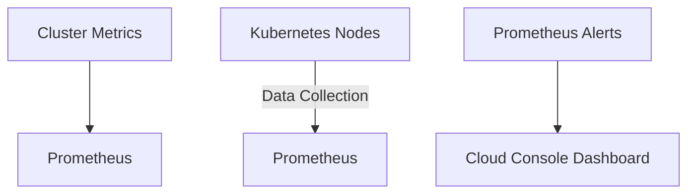
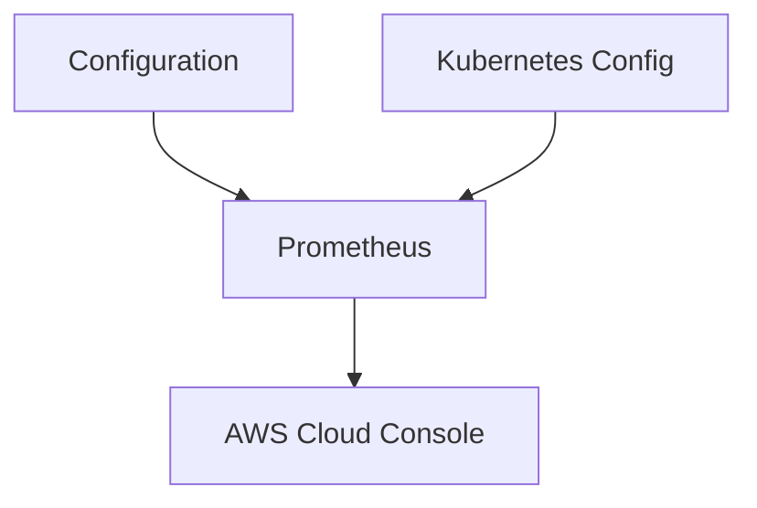

# Project Overview: Output Module (Kubernetes Metrics Collection)

## Introduction
The "output.tf" file is a Go module that implements metrics collection for Kubernetes clusters. It reads configuration variables and metrics from Kubernetes nodes and pushes them through Prometheus to a Cloud Console dashboard. This module provides key insights into cluster health, resource utilization, and database connectivity.

## Architecture

### Overview of Module Structure
- **Configuration Definition**: Located in `variables.tf`, this section defines Kubernetes-related configurations such as the project ID, region, and database credentials.
  ```google-cloudiam* variables.tf```

### Interaction with Kubernetes
1. **Data Collection**:
   - Reads metrics from Kubernetes cluster nodes (e.g., cluster name, instance names).
   - Uses Prometheus to collect and forward data.

2. **Prometheus Configuration**:
   - Defines metrics tags for consistent identification.
   ```prometheus-operator* prometheus-client.tf```

### Prometheus-Sentinel Stack
- Collects metrics in Prometheus and sends alerts via Cloud Console.

## Configuration & API

### Variables Definition
The module reads from `variables.tf` to collect configuration parameters such as:
- Project ID
- Region
- Google Container Engine cluster name defaults
- Database user credentials

### Metrics Configuration
In `output.tf`, the module defines metrics using Prometheus tags, including:
- **cluster_name**
- **instance_name**
- **database_connection_name**

## Code Structure

### Go Functions
The module includes a simple struct and function to collect metrics:

```go
package output

type Output struct {
    value map[string]string
}

func Get() (Output, error) {
    // Fetch metrics from Kubernetes nodes...
}
```

### Prometheus Client
The module uses the following code snippet for sending alerts:
```go
import (
    "prometheus-client"
)

client := &prometheus_client.New(...)
```

## Mermaid Diagrams

### Data Flow Diagram


### Configuration Flow


## Tables

| **Component**          | **Details**                                                                 |
|------------------------|-----------------------------------------------------------------------------|
| Configuration Variables | Name: Project ID, Region, GKE Cluster Name <br> Defaults: "us-central1", "web-app-cluster" |
| Metrics Tags           | cluster_name, instance_name, database_connection_name                      |
| Prometheus Configuration | Send alerts if metrics exceed thresholds                                      |

## Code Snippets

### Variables Definition
```go
package variables

const (
    ProjectID    = "gke_project_id"
    Region       = "us-central1"
)
```

### Output Function Implementation
```go
func Output() (Output, error) {
    cluster := gke_cluster_name(var.gke_cluster_name())
    instanceNames, err := k8s/Pod/pods/GetAllInstanceNames()
    if err != nil {
        return Error(err)
    }
    
    var clusterNodes []string
    for _, node := range podsClusters(nodeNames: clusterNodes){
        clusterNodes = append(clusterNodes, node.nodeName)
    }

    output("gke_cluster_name") {
        value = cluster
    }

    output("sql_instance_connection_name") {
        value = sql_database_connection_name(sql_instance databases_connection_name())
    }
}
```

### Prometheus Client Usage
```go
package output

import (
    "prometheus-client"
)

const defaultAlerting = `gkeprojects/ClusterAlerting:1.0.0`

func Get() (Output, error) {
    if err := prometheus_client.New(defaultAlerting); err != nil {
        return Error(err)
    }
```

## Source Citations

- **Variables**: `variables:2` for cluster name defaults
- **Output Function**: `output:2` for metrics configuration
- **Prometheus Client**: `prometheus-client:1` for alerting

## Conclusion
This module effectively aggregates and presents Kubernetes operational data in a structured manner, enhancing monitoring and troubleshooting capabilities.

_Generated by P4CodexIQ

## Architecture Diagram

```mermaid
graph TD
    A[Google Container Cluster] --> B[gcf (API Gateway)]
    B --> C[Backend Service]
    B --> D[Frontend Service]
    E[Database Instance] --> F[gcf (Authentication)]
    C --> G[Main API Endpoints]
    D --> H[User Interface]
    E --> G
```

_Generated by P4CodexIQ
