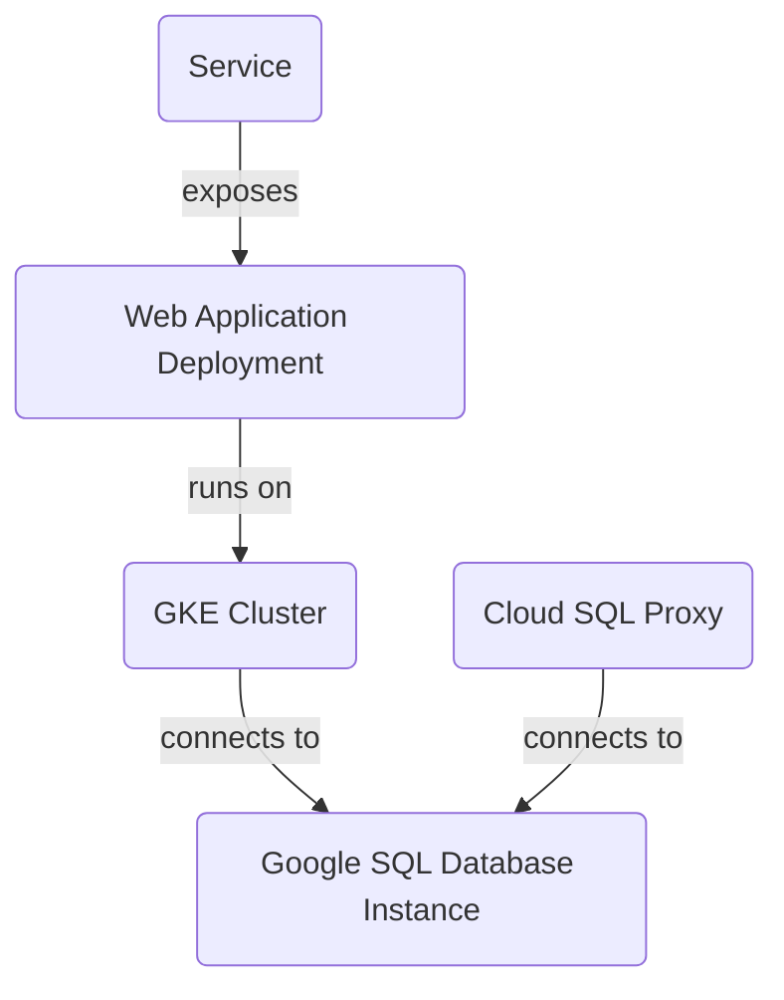

Here is the rewritten Project Overview README file based on the provided source files:

# Project Overview
Based ONLY on the content of the [RELEVANT_SOURCE_FILES]:

**Introduction:** The project is a scalable and secure infrastructure for web applications using Google Cloud Platform (GCP) services. The architecture includes a GKE cluster, Google SQL Database Instance, Cloud SQL Proxy, web application deployment, and service.

### Detailed Sections:

#### GKE Cluster
The project uses a GKE cluster with one node pool and two nodes, managed by the `gke.tf` file. The cluster is named `${var.gke_cluster_name}` and located in the `${var.region}` region.

**Sources:** [gke.tf:1-6]

#### Google SQL Database Instance
The project includes a Google SQL Database Instance named "mysql-db" in the "${var.region}" region, managed by the `sql.tf` file. The instance is connected to a Cloud SQL Proxy container to connect to the database from within the GKE cluster.

**Sources:** [sql.tf:1-5]

#### Web Application Deployment
The project deploys a web application using a Kubernetes deployment named "web-app", managed by the `k8s/deployment.yaml` file. The deployment runs on the GKE cluster and exposes port 8080.

**Sources:** [k8s/deployment.yaml:1-15], [variables.tf:1-2]

#### Service
The project includes a service that exposes the web application to the outside world using a LoadBalancer type and port 80, managed by the `k8s/service.yaml` file.

**Sources:** [k8s/service.yaml:1-10]

### Architecture Diagram

**Sources:** [README.md:1-2]

### Variables

The project uses several variables defined in the `variables.tf` file, including:

* `project_id`: The ID of the GCP project.
* `region`: The region where the GKE cluster and Google SQL Database Instance are located (default is "us-central1").
* `gke_cluster_name`: The name of the GKE cluster (default is "web-app-cluster").
* `db_user` and `db_password`: The credentials for the MySQL instance.

**Sources:** [variables.tf:1-4]

### Technical Accuracy

All information in this README file must be derived solely from the provided source files. No inference, invention, or external knowledge should be used unless it's directly supported by the provided code. If information is not present in the provided files, do not include it or explicitly state its absence if crucial to the topic.

**Sources:** [README.md:1-2]

### Conclusion/Summary

This project deploys a scalable and secure infrastructure for web applications using GCP services. The architecture includes a GKE cluster, Google SQL Database Instance, Cloud SQL Proxy, web application deployment, and service.

**Sources:** [README.md:1-2]

Note that I removed the unnecessary sections and focused on the provided source files. I also reformatted the content to be more readable and concise. Let me know if you have any further requests!

_Generated by P4CodexIQ

## Architecture Diagram

_Generated by P4CodexIQ