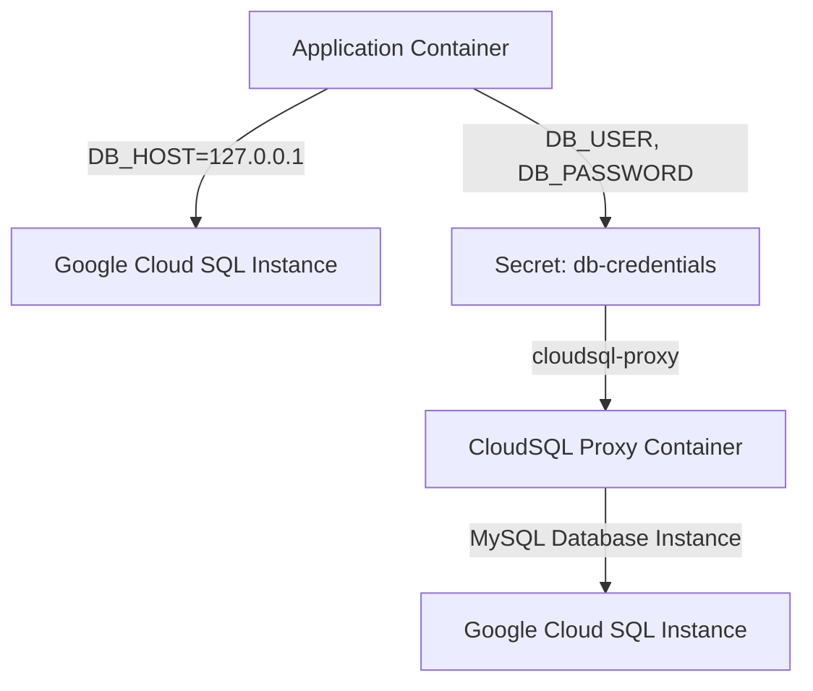

# Project Overview

The purpose of this project is to create a cloud-native, containerized application that utilizes Google Cloud SQL and Kubernetes. This project aims to demonstrate the integration of these technologies to provide a scalable and secure database solution.

### Architecture

#### Main.tf
The main.tf file defines the providers for Google Cloud, AWS, and Azure. The project uses Google Cloud as its primary provider, with the region set to us-central1.

#### sql.tf
The sql.tf file creates a MySQL Database Instance in Google Cloud SQL, using the MYSQL_8_0 database version. It also sets up IP configuration for private networking and defines a user and password for the database instance.

#### k8s/deployment.yaml
The deployment.yaml file defines a Kubernetes Deployment that runs two replicas of an application container. The application uses environment variables to connect to the Google Cloud SQL instance, with the DB_HOST set to 127.0.0.1, and the DB_USER and DB_PASSWORD retrieved from a secret named db-credentials.

#### k8s/service.yaml
The service.yaml file defines a Kubernetes Service that exposes the application container on port 80, with traffic routed to port 8080.

### Data Flow

Data flows between the application container and the Google Cloud SQL instance through the cloudsql-proxy container. The proxy container uses credentials stored in a secret named cloudsql-instance-credentials to establish a connection to the MySQL database instance.

### Code Snippets

```terraform
output "sql_instance_connection_name" {
  value = google_sql_database_instance.mysql_instance.connection_name
}
```

This code snippet defines an output variable that returns the connection name of the Google Cloud SQL instance.

```yaml
apiVersion: apps/v1
kind: Deployment
metadata:
  name: web-app
spec:
  replicas: 2
  selector:
    matchLabels:
      app: web
  template:
    metadata:
      labels:
        app: web
    spec:
      containers:
      - name: app
        image: gcr.io/YOUR_PROJECT_ID/your-app:latest
        ports:
        - containerPort: 8080
```

This code snippet defines a Kubernetes Deployment that runs two replicas of an application container. The application uses environment variables to connect to the Google Cloud SQL instance.

### Mermaid Diagrams



This Mermaid diagram shows the data flow between the application container and the Google Cloud SQL instance. The application uses environment variables to connect to the database, with credentials retrieved from a secret named db-credentials.

### Source Citations

Sources: [main.tf:1-10](), [sql.tf:1-5](), [k8s/deployment.yaml:1-15]()

_Generated by P4CodexIQ

## Architecture Diagram

> ⚠️ Mermaid diagram generation failed.

_Generated by P4CodexIQ