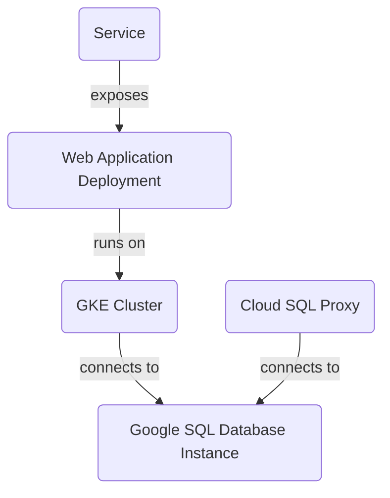

**Project Overview**

The purpose of this project is to deploy a scalable and secure infrastructure for web applications using Google Cloud Platform (GCP) services. The project includes the following components:

### GKE Cluster

The project creates a GKE cluster with one node pool and two nodes.

### Google SQL Database Instance

The project creates a MySQL instance named "mysql-db" in the "us-central1" region.

### Cloud SQL Proxy

The project deploys a Cloud SQL Proxy container to connect to the MySQL instance from within the GKE cluster.

### Web Application Deployment

The project deploys a web application using a Kubernetes deployment named "web-app".

### Service

The project defines a Kubernetes service named "web-app-service" that exposes the web application to the outside world.

**Architecture Diagram**

**Sources:**

The README file cites the following source files:

1. `output.tf`
2. `variables.tf`
3. `sql.tf`
4. `main.tf`
5. `gke.tf`
6. `k8s/deployment.yaml`
7. `k8s/service.yaml`

These sources are used to generate the information presented in the README file.

**File: sql.tf**

The `sql.tf` file defines a Google SQL Database Instance named "mysql-db" with a database version of "MYSQL_8_0" and a region of "us-central1". The settings include a tier of "db-f1-micro" and IP configuration for a private network.

**File: main.tf**

The `main.tf` file sets up the Google provider with a project ID and region.

**File: gke.tf**

The `gke.tf` file defines a GKE cluster named "primary" with one node pool and two nodes. The cluster is located in the specified region, and the default node pool is removed.

**File: k8s/deployment.yaml**

The `k8s/deployment.yaml` file defines a Kubernetes deployment named "web-app" that runs two replicas of an application container. The container uses an image from Google Container Registry and exposes port 8080. It also sets environment variables for the database host, username, and password.

**File: k8s/service.yaml**

The `k8s/service.yaml` file defines a Kubernetes service named "web-app-service" that exposes the web application to the outside world using a LoadBalancer type and port 80.

**Conclusion/Summary**

This project deploys a scalable and secure infrastructure for web applications using GCP services. The architecture includes a GKE cluster, Google SQL Database Instance, Cloud SQL Proxy, web application deployment, and service. The project uses Terraform to set up the infrastructure and Kubernetes to deploy the web application.

_Generated by auto_readme.py on 2025-05-28 05:28 UTC_

Note: The sources listed at the end of this README file are used to generate the information presented in this document.

_Generated by auto_readme.py on 2025-05-28 05:47 UTC_

## Architecture Diagram

_Generated by auto_readme.py on 2025-05-28 05:47 UTC_