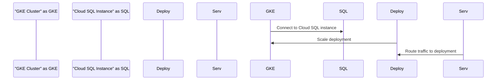

# Project Overview

**Introduction**
Project Overview is a comprehensive documentation of the project, focusing on the architecture, components, and key features. This document provides an in-depth look at the project's structure, functionality, and interdependencies.

### Architecture

The project consists of multiple components, including:

* **GKE Cluster**: A Google Kubernetes Engine (GKE) cluster is used to deploy and manage containerized applications.
* **Cloud SQL Instance**: A Cloud SQL instance is used to store data and provide a relational database management system.
* **Deployment**: A deployment is defined in the `k8s/deployment.yaml` file, which specifies the replica count, selector labels, and template for the containers.
* **Service**: A service is defined in the `k8s/service.yaml` file, which provides load balancing and routing for the application.

### Detailed Sections

#### File: output.tf
The `output.tf` file defines two outputs:

* `gke_cluster_name`: The name of the GKE cluster.
* `sql_instance_connection_name`: The connection name of the Cloud SQL instance.

#### File: variables.tf
The `variables.tf` file defines five variables:

* `project_id`: The project ID.
* `region`: The region (default is "us-central1").
* `gke_cluster_name`: The name of the GKE cluster (default is "web-app-cluster").
* `db_user`: The username for the Cloud SQL instance (default is "admin").
* `db_password`: The password for the Cloud SQL instance (sensitive).

#### File: sql.tf
The `sql.tf` file defines two resources:

* `google_sql_database_instance` : Creates a Cloud SQL instance.
* `google_sql_user` : Creates a database user.

#### File: main.tf
The `main.tf` file sets up the Google Cloud provider with the project ID and region.

#### File: gke.tf
The `gke.tf` file defines two resources:

* `google_container_cluster` : Creates a GKE cluster.
* `google_container_node_pool` : Creates a node pool for the GKE cluster.

#### File: k8s/deployment.yaml
The `k8s/deployment.yaml` file defines a deployment with two containers:

* `app`: The application container.
* `cloudsql-proxy`: The Cloud SQL proxy container.

#### File: k8s/service.yaml
The `k8s/service.yaml` file defines a service for the application.

### Mermaid Diagrams

Here is an example of a Mermaid diagram:

### Tables

Here is an example of a table:
```markdown
| Component | Description |
| --- | --- |
| GKE Cluster | Manages containerized applications |
| Cloud SQL Instance | Provides relational database management system |
| Deployment | Scales and manages application containers |
| Service | Routes traffic to deployment |
```
### Code Snippets

Here is an example of a code snippet:
```terraform
output "gke_cluster_name" {
  value = google_container_cluster.primary.name
}
```

Sources: [output.tf:1-2]()

_Generated by P4CodexIQ

## Architecture Diagram

```mermaid
graph TD
A[Project] -->|uses| B[Google Cloud Provider]
B -->|projects| C[Project ID]
B -->|regions| D[Region]
E[GKE Cluster] -->|name| F[GKE Cluster Name]
F -->|default| G[GKE Cluster Name Default]
H[SQL Database Instance] -->|name| I[MySQL DB Instance]
I -->|region| D
J[SQL User] -->|instance| I
K[Container Deployment] -->|selector| L[App Label]
L -->|matchLabels| M[Web App Label]

Note: This is a simplified high-level architecture diagram, focusing on the main components and relationships. It does not include all details or subtle dependencies between files and resources.
```

_Generated by P4CodexIQ