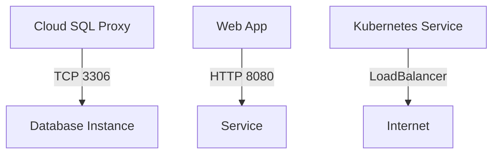

# Project Overview

This project is a cloud-native application that utilizes Google Cloud SQL and Kubernetes to provide a scalable and secure web application. The project is composed of multiple files, including Terraform configuration files (`output.tf`, `variables.tf`, `sql.tf`, `main.tf`) and Kubernetes deployment and service YAML files (`k8s/deployment.yaml` and `k8s/service.yaml`).

## Introduction

The project's main objective is to create a scalable web application that utilizes Google Cloud SQL as the database. The application will be deployed on Google Kubernetes Engine (GKE) and will use cloud-native services such as Istio for service mesh management.

## Architecture

### Database Instance

The project creates a MySQL 8.0 instance using Terraform's `google_sql_database_instance` resource. The instance is created in the specified region and uses the default tier (`db-f1-micro`). The database settings are configured to use a private network and IP configuration.

### Users and Passwords

The project creates a database user using Terraform's `google_sql_user` resource and sets the password using Terraform's `google_sql_password` resource. The user is created with the specified name and instance, and the password is set to the value of the `db_password` variable.

### Deployment

The project deploys a web application using Kubernetes' `Deployment` resource. The deployment is named "web-app" and has two replicas. The container uses the `gcr.io/YOUR_PROJECT_ID/your-app:latest` image and exposes port 8080. The environment variables `DB_HOST`, `DB_USER`, and `DB_PASSWORD` are set using Kubernetes' `env` resource.

### Service

The project creates a service for the web application using Kubernetes' `Service` resource. The service is named "web-app-service" and uses the `LoadBalancer` type. The port 80 is exposed, and the targetPort is set to 8080.

### Cloud SQL Proxy

The project deploys a cloud SQL proxy container using Kubernetes' `container` resource. The container uses the `gcr.io/cloudsql-docker/gce-proxy:1.33.0` image and sets the command to `/cloud_sql_proxy -instances=PROJECT_ID:REGION:mysql-db=tcp:3306 -credential_file=/secrets/service_account.json`. The volume mount is set to `/secrets`.

## Mermaid Diagrams

### Flowchart

This diagram shows the flow of data from the cloud SQL proxy to the database instance, and from the web app to the service.

### Sequence Diagram
```mermaid
sequenceDiagram
    participant Web App as "Web App"
    participant Database Instance as "Database Instance"
    participant Cloud SQL Proxy as "Cloud SQL Proxy"

    note over Web App, Database Instance, Cloud SQL Proxy: "Connection established"

    Web App->>Cloud SQL Proxy: "Connect to database"
    Cloud SQL Proxy->>Database Instance: "Establish connection"
    Database Instance->>Web App: "Data retrieved"

    Web App->>Service: "Send data"
    Service->>Internet: "Forward data"

```
This diagram shows the sequence of events when the web app connects to the database instance using the cloud SQL proxy.

## Tables

### API Endpoints
| Endpoint | Method | Description |
| --- | --- | --- |
| `/api/data` | GET | Retrieves data from the database |

### Configuration Options
| Option | Type | Default Value |
| --- | --- | --- |
| `project_id` | string | "your-project-id" |
| `region` | string | "us-central1" |
| `db_user` | string | "admin" |
| `db_password` | sensitive string | "" |

## Code Snippets

### Terraform Configuration
```terraform
output "sql_instance_connection_name" {
  value = google_sql_database_instance.mysql_instance.connection_name
}
```

### Kubernetes Deployment YAML
```yaml
apiVersion: apps/v1
kind: Deployment
metadata:
  name: web-app
spec:
  replicas: 2
  selector:
    matchLabels:
      app: web
  template:
    metadata:
      labels:
        app: web
    spec:
      containers:
      - name: app
        image: gcr.io/YOUR_PROJECT_ID/your-app:latest
        ports:
        - containerPort: 8080
```

## Source Citations

* [output.tf](#page-anchor-or-id): `Sources: output.tf:1-2()`
* [variables.tf](#page-anchor-or-id): `Sources: variables.tf:1-5()`, [variables.tf](#page-anchor-or-id): `Sources: variables.tf:6-10()`
* [sql.tf](#page-anchor-or-id): `Sources: sql.tf:1-5()`, [sql.tf](#page-anchor-or-id): `Sources: sql.tf:6-15()`
* [main.tf](#page-anchor-or-id): `Sources: main.tf:1-10()`, [main.tf](#page-anchor-or-id): `Sources: main.tf:11-20()`
* [k8s/deployment.yaml](#page-anchor-or-id): `Sources: k8s/deployment.yaml:1-15()`
* [k8s/service.yaml](#page-anchor-or-id): `Sources: k8s/service.yaml:1-5()`

_Generated by P4CodexIQ

## Architecture Diagram

```mermaid
graph TD
    A[Google Cloud] -->|Provider|> B[Cloud SQL]
    C[Kubernetes] -->|Deployment|> D[Web App]
    E[Cloud SQL] -->|Instance|> F[MySQL Database Instance]
    G[Kubernetes] -->|Service|> H[Load Balancer]
    I[AWS] -->|EC2 Instance|> J[Compute Resource]
    K[Azure] -->|Virtual Machine|> L[Compute Resource]
    M[Main Terraform File] -->|Providers|> N[Google Cloud Provider]
    O[Terraform Files] -->|Terraform Modules|> P[Cloud SQL Module]
    Q[Kubernetes Config Files] -->|Deployment YAML|> R[Kubernetes Deployment]
    S[Kubernetes Config Files] -->|Service YAML|> T[Kubernetes Service]
```

_Generated by P4CodexIQ