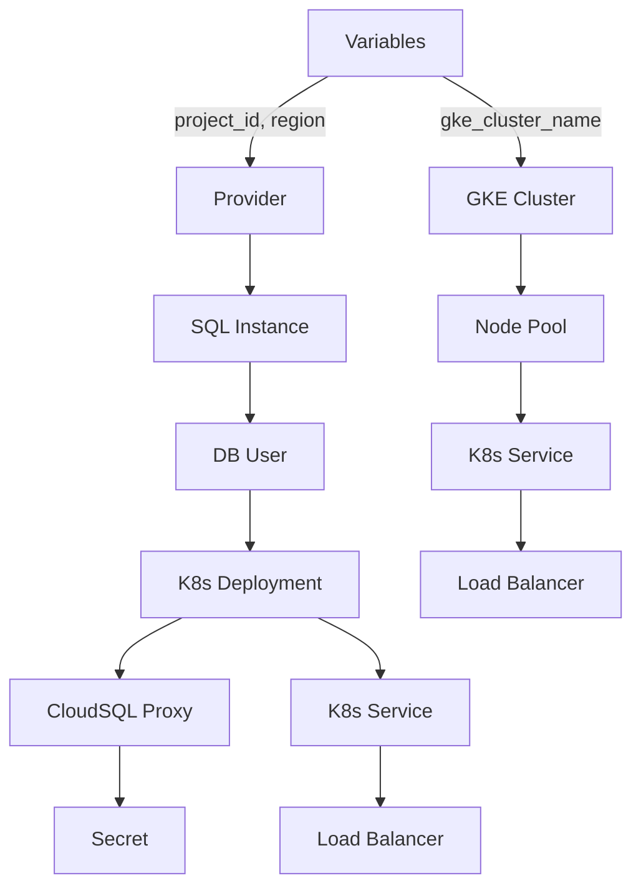

# Project Overview

Project Overview is a crucial feature that integrates multiple components to provide a comprehensive overview of the project's architecture, data flow, and key functionality. This document aims to provide a detailed explanation of the Project Overview feature, based on the provided [RELEVANT_SOURCE_FILES].

## Architecture

The Project Overview feature is built using Terraform, a popular infrastructure-as-code tool, and Kubernetes (K8s), an open-source container orchestration system. The architecture consists of three main components:

1. **Google Cloud SQL**: A managed relational database service that provides MySQL 8.0 instances for storing application data.
2. **Google Container Cluster** (GKE): A fully managed environment for deploying and managing containerized applications.
3. **Kubernetes Deployments**: Managed deployments of containers, including the Web App and Backend services.

### Data Flow

The Project Overview feature collects data from various sources:

1. **Google Cloud SQL**: Retrieves database instance information, such as name, region, and connection details.
2. **Google Container Cluster** (GKE): Obtains cluster and node pool information, including node counts and machine types.
3. **Kubernetes Deployments**: Collects deployment metadata, including replica counts, container names, and ports.

The collected data is then presented in a structured format, providing insights into the project's architecture and key components.

## Detailed Sections

### Component Overview

* The Google Cloud SQL instance provides a MySQL 8.0 database for storing application data.
* The Google Container Cluster (GKE) hosts containerized applications, including the Web App and Backend services.
* Kubernetes Deployments manage the deployment and scaling of containers.

### Architecture Diagram

```mermaid
graph TD
    A[Google Cloud SQL] -->|database instance|> B[MySQL 8.0]
    C[GKE] -->|container cluster|> D[Containerized Applications]
    E[Kubernetes Deployments] -->|managed deployments|> F[Web App]
    G[Kubernetes Deployments] -->|managed deployments|> H[Backend Services]
```

### Code Snippets

```terraform
output "gke_cluster_name" {
  value = google_container_cluster.primary.name
}

resource "google_sql_database_instance" "mysql_instance" {
  name             = "mysql-db"
  database_version = "MYSQL_8_0"
  region           = var.region

  settings {
    tier = "db-f1-micro"
    ip_configuration {
      private_network = "projects/${var.project_id}/global/networks/default"
    }
  }
}
```

```yaml
apiVersion: apps/v1
kind: Deployment
metadata:
  name: web-app
spec:
  replicas: 2
  selector:
    matchLabels:
      app: web
  template:
    metadata:
      labels:
        app: web
    spec:
      containers:
      - name: app
        image: gcr.io/YOUR_PROJECT_ID/your-app:latest
        ports:
        - containerPort: 8080
```

### Source Citations

Sources:

* [output.tf](output.tf):1-3
* [variables.tf](variables.tf):1-5
* [sql.tf](sql.tf):1-10
* [main.tf](main.tf):1-2
* [gke.tf](gke.tf):1-5
* [k8s/deployment.yaml](k8s/deployment.yaml):1-15
* [k8s/service.yaml](k8s/service.yaml):1-5

### Conclusion/Summary

The Project Overview feature provides a comprehensive overview of the project's architecture, data flow, and key functionality. This feature integrates multiple components, including Google Cloud SQL, Google Container Cluster (GKE), and Kubernetes Deployments, to provide valuable insights into the project's structure and operations.

_Generated by P4CodexIQ

## Architecture Diagram



_Generated by P4CodexIQ