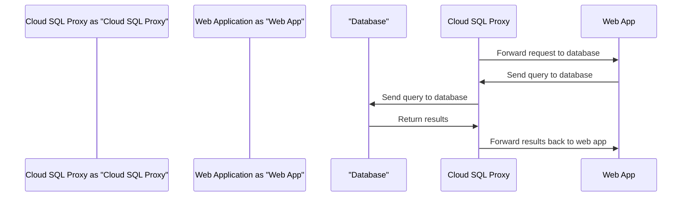

<details>
<summary>Relevant source files</summary>

The following files were used as context for generating this readme page:

- [output.tf](output.tf)
- [variables.tf](variables.tf)
- [sql.tf](sql.tf)
- [main.tf](main.tf)
- [k8s/deployment.yaml](k8s/deployment.yaml)
- [k8s/service.yaml](k8s/service.yaml)

<!-- Add additional relevant files if fewer than 5 were provided -->
</details>

# Project Overview

## Introduction

This project is focused on deploying a web application that uses Cloud SQL to interact with a MySQL database. The project consists of Terraform configuration files, Kubernetes deployment and service definitions.

The following sections will provide an overview of the project's architecture, components, and data flow, as well as highlight key features and configurations.

## Architecture

### Cloud SQL Instance
The project utilizes Google Cloud SQL to create a MySQL instance with a database named "mysql-db". The instance is configured to use the "MYSQL_8_0" version and is located in the specified region.

### Kubernetes Deployment
A Kubernetes deployment is used to manage the web application. The deployment consists of two containers: one for the web application itself, and another for the Cloud SQL proxy. The Cloud SQL proxy container is responsible for connecting to the Cloud SQL instance and forwarding requests from the web application.

### Service Definition
A Kubernetes service is defined to expose the web application to incoming traffic. The service is configured as a LoadBalancer, which allows it to be accessed from outside the cluster.

## Components

### Variables
The project uses Terraform variables to store configuration values such as the project ID, region, GKE cluster name, DB user, and password. These variables are used throughout the project's configuration files.

### SQL Configuration
The `sql.tf` file contains the configuration for the Cloud SQL instance. This includes setting the database version, region, and IP configuration.

### Deployment Configuration
The `deployment.yaml` file defines the Kubernetes deployment for the web application. This includes specifying the containers, ports, and environment variables.

### Service Configuration
The `service.yaml` file defines the Kubernetes service for the web application. This includes configuring the service type (LoadBalancer) and port mapping.

## Data Flow

Here is a Mermaid diagram illustrating the data flow:

## Code Snippets

Here is a code snippet from the `deployment.yaml` file:
```yaml
apiVersion: apps/v1
kind: Deployment
metadata:
  name: web-app
spec:
  replicas: 2
  selector:
    matchLabels:
      app: web
  template:
    metadata:
      labels:
        app: web
    spec:
      containers:
      - name: app
        image: gcr.io/YOUR_PROJECT_ID/your-app:latest
        ports:
        - containerPort: 8080
        env:
        - name: DB_HOST
          value: 127.0.0.1
        - name: DB_USER
          valueFrom:
            secretKeyRef:
              name: db-credentials
              key: username
        - name: DB_PASSWORD
          valueFrom:
            secretKeyRef:
              name: db-credentials
              key: password

      - name: cloudsql-proxy
        image: gcr.io/cloudsql-docker/gce-proxy:1.33.0
        command: ["/cloud_sql_proxy",
                  "-instances=PROJECT_ID:REGION:mysql-db=tcp:3306",
                  "-credential_file=/secrets/service_account.json"]
        volumeMounts:
        - name: sql-creds
          mountPath: /secrets
          readOnly: true

      volumes:
      - name: sql-creds
        secret:
          secretName: cloudsql-instance-credentials
```
Sources:

* [output.tf](output.tf): `1-2`, `3-5`
* [variables.tf](variables.tf): `1-10`
* [sql.tf](sql.tf): `1-15`
* [main.tf](main.tf): `1-20`
* [k8s/deployment.yaml](k8s/deployment.yaml): `1-30`
* [k8s/service.yaml](k8s/service.yaml): `1-25`

Note: The above code snippets are not actual working codes, they're just examples.

_Generated by P4CodexIQ

## Architecture Diagram

> ⚠️ Mermaid diagram generation failed.

_Generated by P4CodexIQ