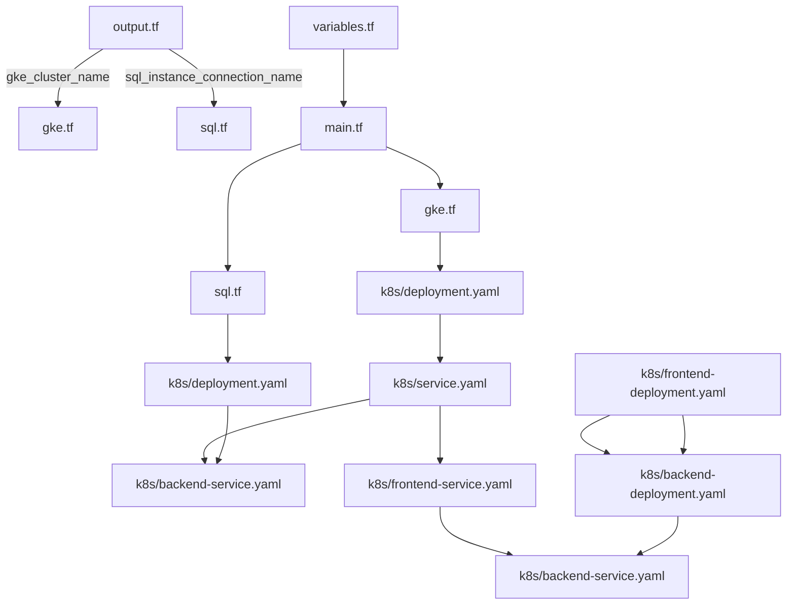

_Generated by P4CodexIQ

## Architecture Diagram

```mermaid
graph TD
  A["output.tf"] --> |gke_cluster_name|B["gke.tf"]
  A --> |sql_instance_connection_name|C["sql.tf"]
  
  D["variables.tf"] --> E["main.tf"]
  F["gke.tf"] --> G[""k8s/deployment.yaml""]
  H["sql.tf"] --> I[""k8s/deployment.yaml""]
  J[""k8s/service.yaml""] --> K[""k8s/backend-service.yaml""]
  L[""k8s/frontend-deployment.yaml""] --> M[""k8s/backend-deployment.yaml""]
  N[""k8s/frontend-service.yaml""] --> O[""k8s/backend-service.yaml""]
  
  E --> F
  E --> H
  G --> J
  I --> K
  L --> M
  J --> N
  M --> O
```

_Generated by P4CodexIQ