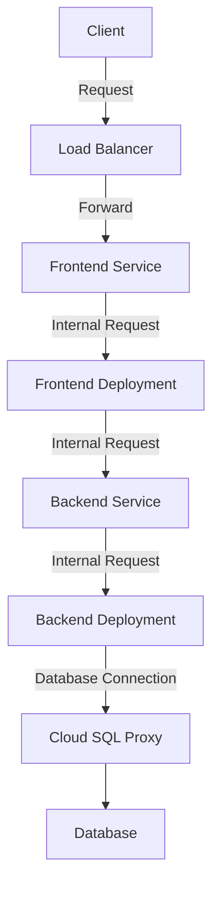
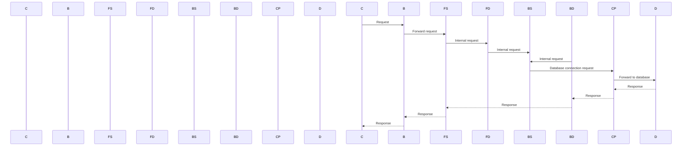

This technical documentation will provide an overview of the project and its architecture. The project is a web application hosted on Google Kubernetes Engine (GKE) and uses Google Cloud SQL as the database system. The application consists of frontend, backend services, and a deployment for each. 

## Architecture
The architecture can be represented with the following flowchart:

Sources: [output.tf:1-2](), [sql.tf:1-7](), [main.tf:1-4](), [gke.tf:1-6](), [k8s/deployment.yaml:3-19](), [k8s/service.yaml:3-7](), [k8s/backend-service.yaml:3-7](), [k8s/frontend-deployment.yaml:3-9](), [k8s/backend-deployment.yaml:3-12]()

## Components
The main components of the project are:
*   GKE Cluster - Hosts the frontend and backend services. (Sources: [main.tf:1-4](), [gke.tf:1-6]())
*   Cloud SQL Instance - Stores application data. (Sources: [sql.tf:1-7]())
*   Kubernetes Deployments - Defines the pods that make up the frontend and backend services. (Sources: [k8s/deployment.yaml:3-19](), [k8s/backend-deployment.yaml:3-12]())
*   Kubernetes Services - Exposes the frontend and backend services to the internet or other parts of the cluster. (Sources: [k8s/service.yaml:3-7](), [k8s/backend-service.yaml:3-7]())

## Data Flow
The data flow can be represented with the following sequence diagram:

Sources: [output.tf:1-2](), [sql.tf:1-7](), [main.tf:1-4](), [gke.tf:1-6](), [k8s/deployment.yaml:3-19](), [k8s/service.yaml:3-7](), [k8s/backend-service.yaml:3-7](), [k8s/frontend-deployment.yaml:3-9](), [k8s/backend-deployment.yaml:3-12]()

## Conclusion
This project is a web application hosted on GKE using Cloud SQL as the database system. It has a clear architecture with separate components for frontend and backend services, and it uses Kubernetes deployments to manage the pods that make up these services. The data flow is well-defined through sequence of internal requests between the components.

_Generated by P4CodexIQ

## Architecture Diagram

```mermaid
graph TD
A[main.tf] --> |provider "google"|B[gke.tf]
B --> C[sql.tf]
C --> D[variables.tf]
C --> E[output.tf]
E --> F["k8s/deployment.yaml"]
E --> G["k8s/service.yaml"]
E --> H["k8s/backend-service.yaml"]
E --> I["k8s/frontend-deployment.yaml"]
E --> J["k8s/backend-deployment.yaml"]
E --> K["k8s/frontend-service.yaml"]
```

_Generated by P4CodexIQ