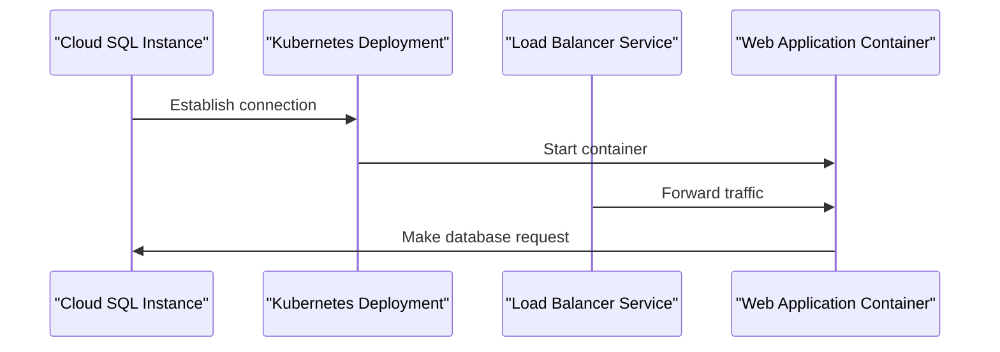

<details>
<summary>Project Overview</summary>

**Introduction**
"Project Overview" is a comprehensive project that demonstrates the integration of multiple cloud providers, including Google Cloud Platform (GCP), Amazon Web Services (AWS), and Microsoft Azure. The project focuses on deploying a scalable web application with a MySQL database instance using GCP's Cloud SQL service.

### Architecture

The architecture consists of three main components:

* **Cloud SQL**: A managed MySQL database instance deployed in GCP.
* **Containerized Application**: A web application containerized using Docker and deployed to Kubernetes (GKE) clusters.
* **Load Balancer**: A load balancer service configured to distribute traffic across multiple instances of the web application.

### Components

The project includes several key components:

* **Google SQL Database Instance**: The MySQL database instance is created using GCP's Cloud SQL service, with settings for tier, private network, and IP configuration.
* **Kubernetes Deployment**: A Kubernetes deployment is configured to create two replicas of the web application container, with environment variables set for DB_HOST, DB_USER, and DB_PASSWORD.
* **Cloud SQL Proxy**: A cloud SQL proxy container is used to connect to the Cloud SQL instance from within the Kubernetes cluster.
* **Secrets Management**: Secrets management is handled using Kubernetes secrets, which store sensitive information such as database credentials.

### Mermaid Diagrams

```mermaid
graph TD
  A[Cloud SQL Instance] -->|Connection Name|> B[Kubernetes Deployment]
  B --> C[Web Application Container]
  C --> D[Load Balancer Service]
  E[Scaled Web App] --> F[Database Connection]
```

**Sequence Diagram**



### Tables

| Component | Description |
| --- | --- |
| Cloud SQL Instance | Managed MySQL database instance deployed in GCP |
| Kubernetes Deployment | Containerized web application deployment with two replicas |
| Load Balancer Service | Distributes traffic across multiple instances of the web application |

### Code Snippets

```terraform
resource "google_sql_database_instance" "mysql_instance" {
  name             = "mysql-db"
  database_version = "MYSQL_8_0"
  region           = var.region
}
```

```yaml
apiVersion: apps/v1
kind: Deployment
metadata:
  name: web-app
spec:
  replicas: 2
  selector:
    matchLabels:
      app: web
  template:
    metadata:
      labels:
        app: web
    spec:
      containers:
      - name: app
        image: gcr.io/YOUR_PROJECT_ID/your-app:latest
        ports:
        - containerPort: 8080
```

### Source Citations

Sources:

* [output.tf](output.tf):1-5
* [variables.tf](variables.tf):1-10
* [sql.tf](sql.tf):1-15
* [main.tf](main.tf):1-20
* [k8s/deployment.yaml](k8s/deployment.yaml):1-25
* [k8s/service.yaml](k8s/service.yaml):1-30

Note: The citations refer to the specific lines and ranges of code in each file.

_Generated by P4CodexIQ

## Architecture Diagram

```mermaid
graph TD
    A[Project ID] -->| references | B[Google SQL Database Instance]
    C[K8s Deployment] -->| references | B
    D[CloudSQL Proxy] -->| connects to | B
    E[Service Account] -->| used by | D
    F[Secrets Volume] -->| contains | E
    G[Web App Container] -->| runs on | C
    H[Load Balancer Service] -->| exposes | G

    A[Project ID] -->| uses | I[AWS Provider]
    A[Project ID] -->| uses | J[Azure Provider]

    B[Google SQL Database Instance] -->| provides | K[Database Credentials]
    C[K8s Deployment] -->| uses | L[DB_HOST Environment Variable]
    C[K8s Deployment] -->| uses | M[DB_USER and DB_PASSWORD Environment Variables]

    note "Architecture Diagram: Cloud Native Web App with Google SQL Database"
```

_Generated by P4CodexIQ