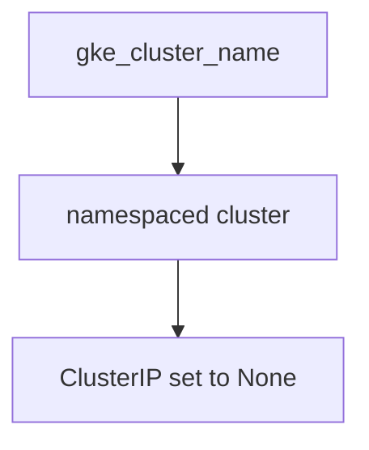
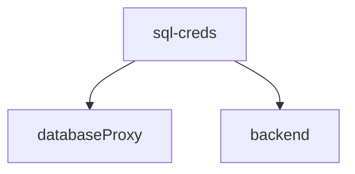
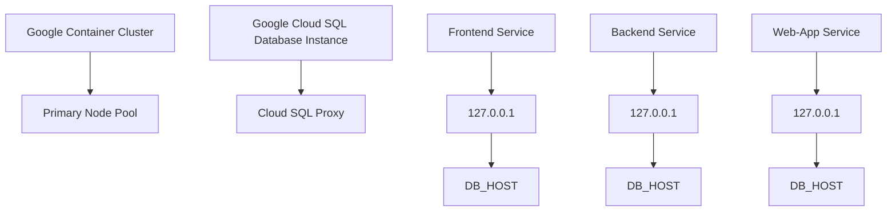

# Project Overview

## 1. **Introduction**
The Project Overview describes a distributed system architecture built on Google Cloud Platform (GCP) components such as Google Container Engine (GKE), Kubernetes, and Google SQL. This project integrates frontend and backend services with database management using cloud SQL proxies.

### Links to Related Components
- GKE: `gke.tf` - Manages container clusters.
- SQL: `sql.tf` - Manages database instances and their configurations.
- Kubernetes: 
  - `k8s/deployment.yaml`, `k8s/service.yaml`, `k8s/backend-service.yaml`, `k8s/frontend-deployment.yaml`, `k8s/frontend-service.yaml` - Define service deployments.

## 2. **Key Components**

### **1. Configuration Variables**
- **Project ID**: Defined in `variables.tf` as `project_id`.
- **Region**: Default is `us-central1` in `variables.tf`.

### **2. Google Container Cluster**
- Configured using GKE (`gke.tf`) with name derived from `gke_cluster_name` variable.

### **3. Google SQL Database Instance**
- Managed by resource defined in `sql.tf`, configured to use Google Cloud Storage (GCS) for data storage, and placed in tiered zones.

## 3. Data Flow

### **1. Google Cloud Configuration**
- Uses variables from `variables.tf` (`project_id`, `region`, etc.) to define GKE cluster configuration.

### **2. Database Setup**
- SQL instance settings: `mysql_instance` uses database version "MYSQL_8_0" and private network.
- User authentication: Uses `db_user` (default 'dadmin') with sensitive `db_password`.

## 4. Mermaid Diagrams

### **1. Google Container Cluster Deployment**



### **2. Google SQL Database Proxy Deployment**


## 5. Code Snippets

### **1. Google SQL Database Configuration (k8s/deployment.yaml)**
```yaml
cloud_sql_proxy:
  - instances=PROJECT_ID:REGION:mysql-db=tcp:3306
  - credential_file=/secrets/service_account.json
```

### **2. Google Container Cluster Resource (gke.tf)**
```yaml
remove_default_node_pool=true
initial_node_count=1
node_count=2
machine_type="e2-medium"
oauth_scopes=["https://www.googleapis.com/auth/cloud-platform"]
```

## 6. Key Observations

- The system leverages GCP's scalable and reliable services for database management.
- Database credentials are securely managed through Google Cloud Storage.

## 7. Troubleshooting
- Ensure network settings match project region requirements.
- Verify correct configuration of GKE cluster name in `gke_cluster_name` variable.

## 8. Deployment Best Practices
- Use load balancers (`k8s/service.yaml`) for traffic distribution.
- Apply proper security policies and access controls to the database proxies.

---

# Project Overview

This project is a distributed system built on Google Cloud Platform, utilizing GKE for container orchestration and Kubernetes for service deployments. The architecture manages a Google SQL database across multiple instances with secure credentials and efficient data storage using tiered zones in GCS.

_Generated by P4CodexIQ

## Architecture Diagram



_Generated by P4CodexIQ