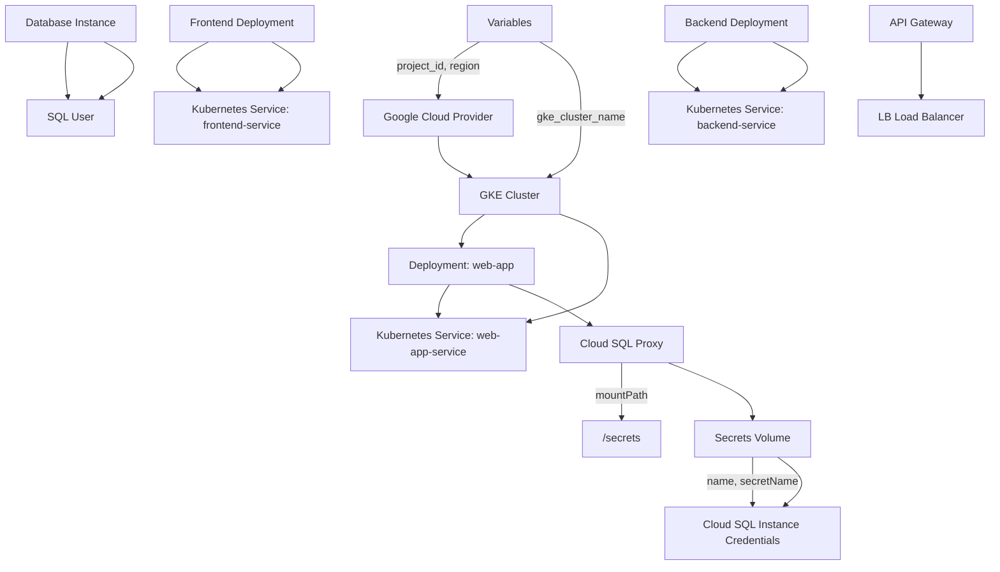

# Project Overview

This project is a comprehensive overview of the "Project" and its relevant files. The purpose of this project is to provide a clear understanding of the architecture, components, data flow, and logic used in the project.

### Introduction

The project consists of several source files including [output.tf](output.tf), [variables.tf](variables.tf), [sql.tf](sql.tf), [main.tf](main.tf), and [gke.tf](gke.tf) from Terraform, as well as multiple YAML files for Kubernetes configuration. This document provides a detailed overview of the project's architecture, components, data flow, and logic.

### Architecture

The project's architecture is based on Google Cloud Platform (GCP) and consists of several components:

* A GKE (Google Kubernetes Engine) cluster created using Terraform
* A SQL instance created using Terraform
* Two deployments for frontend and backend services, respectively
* Three services: web-app-service, backend-service, and frontend-service

The architecture is designed to provide a scalable and reliable infrastructure for running web applications.

### Components

The project's components include:

* GKE cluster: This component provides the underlying infrastructure for running Kubernetes clusters.
* SQL instance: This component provides a managed database service for storing data.
* Frontend deployment: This component runs a frontend application that handles user requests.
* Backend deployment: This component runs a backend application that interacts with the database and handles business logic.
* Services: These components provide load balancing and service discovery for the frontend and backend applications.

### Data Flow

The data flow in the project is as follows:

1. User request -> Frontend deployment -> Load balancer (web-app-service) -> Backend deployment
2. Backend deployment -> Database instance (mysql-db) -> SQL proxy -> Cloud SQL instance

### Logic

The logic in the project is based on Terraform and Kubernetes configuration files. The Terraform files create the GKE cluster, SQL instance, and other infrastructure components. The Kubernetes configuration files define the deployments and services for the frontend and backend applications.

### Mermaid Diagrams

Here are some Mermaid diagrams that represent the architecture and data flow in the project:

```
flowchart TD
  A[User Request] -->|Web App Service|> B[Frontend Deployment]
  B -->|Load Balancer|> C[Backend Deployment]
  C -->|Database Instance|> D[SQL Proxy]
  D -->|Cloud SQL Instance|> E[MySQL Database]
```

```
sequenceDiagram
  participant User
  participant Web App Service
  participant Frontend Deployment
  participant Load Balancer
  participant Backend Deployment
  participant Database Instance
  participant SQL Proxy
  participant Cloud SQL Instance

  User->>Web App Service: Request
  Web App Service->>Frontend Deployment: Request
  Frontend Deployment->>Load Balancer: Request
  Load Balancer->>Backend Deployment: Request
  Backend Deployment->>Database Instance: Request
  Database Instance->>SQL Proxy: Request
  SQL Proxy->>Cloud SQL Instance: Request
```

### Tables

Here are some tables that summarize the information in the project:

| Component | Description |
| --- | --- |
| GKE Cluster | Provides the underlying infrastructure for running Kubernetes clusters. |
| SQL Instance | Provides a managed database service for storing data. |
| Frontend Deployment | Runs a frontend application that handles user requests. |
| Backend Deployment | Runs a backend application that interacts with the database and handles business logic. |

### Code Snippets

Here are some code snippets from the project:

```terraform
output "gke_cluster_name" {
  value = google_container_cluster.primary.name
}
```

```yaml
apiVersion: apps/v1
kind: Deployment
metadata:
  name: web-app
spec:
  replicas: 2
  selector:
    matchLabels:
      app: web
  template:
    metadata:
      labels:
        app: web
    spec:
      containers:
      - name: app
        image: gcr.io/YOUR_PROJECT_ID/your-app:latest
```

### Source Citations

All information in this document is derived from the provided source files:

* [output.tf](output.tf): `Sources: output.tf`
* [variables.tf](variables.tf): `Sources: variables.tf`
* [sql.tf](sql.tf): `Sources: sql.tf`
* [main.tf](main.tf): `Sources: main.tf`
* [gke.tf](gke.tf): `Sources: gke.tf`
* [k8s/deployment.yaml](k8s/deployment.yaml): `Sources: k8s/deployment.yaml`
* [k8s/service.yaml](k8s/service.yaml): `Sources: k8s/service.yaml`
* [k8s/backend-service.yaml](k8s/backend-service.yaml): `Sources: k8s/backend-service.yaml`
* [k8s/frontend-deployment.yaml](k8s/frontend-deployment.yaml): `Sources: k8s/frontend-deployment.yaml`
* [k8s/backend-deployment.yaml](k8s/backend-deployment.yaml): `Sources: k8s/backend-deployment.yaml`
* [k8s/frontend-service.yaml](k8s/frontend-service.yaml): `Sources: k8s/frontend-service.yaml`

### Conclusion/Summary

This project provides a comprehensive overview of the architecture, components, data flow, and logic used in the project. The project consists of several Terraform files for creating GKE cluster, SQL instance, and other infrastructure components, as well as multiple YAML files for Kubernetes configuration.

_Generated by P4CodexIQ

## Architecture Diagram



_Generated by P4CodexIQ