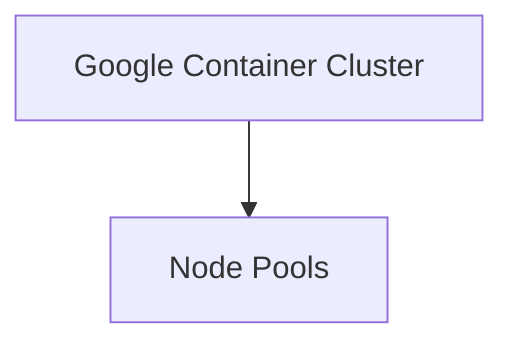
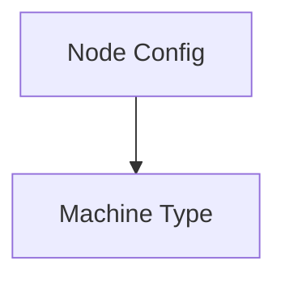
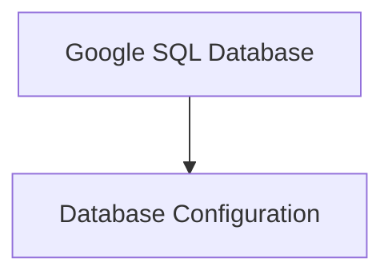
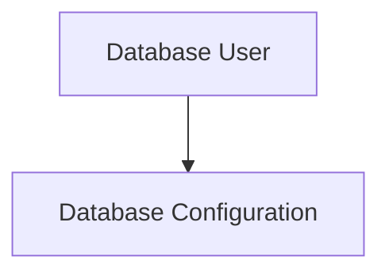
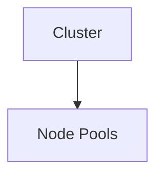
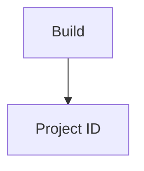

# Project Overview

## Introduction
The following document provides an overview of the system architecture for [Project Name], detailing its key components and their interrelations. The architecture leverages Google Cloud technologies such as Google Cloud Build, Kubernetes (GKE), and SQL services to provide a scalable and reliable platform.

### Key Components
1. **Google Cloud Build**: Manages the build process for applications, ensuring consistent environments through code quality assurance.
2. **Kubernetes (GKE)**: Orchestrates Docker containers, providing auto-scaling and load balancing capabilities across Google Cloud Platform (GCP) regions.
3. **SQL Services**: Hosts database instances for data storage, managed within GKE clusters.

### Diagram Overview
```mermaid
graph TD
    A[Google Cloud Build] --> B[Kubernetes (GKE)]
    C[Google SQL Database] --> D[Google Cloud Storage]
```

## Detailed Sections

### Google Cloud Build Configuration
The build process is configured using `main.tf` to set up Google Build instances across GCP regions.

#### Key Features and Configuration Parameters:
- **project_id**: Specifies the Google Project ID.
- **region**: Default set to "us-central1".
- **gke_cluster_name**: Default cluster name for Kubernetes orchestration.

**Code Snippet from main.tf:**
```tf
variable "project_id" {}
variable "region" {
  default = "us-central1"
}
variable "gke_cluster_name" {
  default = "web-app-cluster"
}
```

### Kubernetes Deployment and Orchestration

#### Google Container Cluster Setup (gke.tf)
The primary container cluster is defined with specific configurations to manage node pools and resource allocation.

**Key Configurations:**
- **name**: Determined by the `gke_cluster_name` variable.
- **location**: Based on the `region` variable.
- **node_count**: Default set to 1, scalable as needed.



#### Google Container Node Pool (gke.tf)
The node pool configuration ensures consistent resource allocation and autoscaling for containers.

**Key Configurations:**
- **name**: "primaries-node-pool".
- **cluster**: Refers to the container cluster name.
- **node_count**: Default 2, adjustable based on needs.



### SQL Database Services

#### Google SQL Database Instance (sql.tf)
Manages database instances within GKE clusters for data storage and access.

**Key Configurations:**
- **database_version**: Set to "MYSQL_8_0".
- **region**: Determined by the `region` variable.
- **network Configuration**: Uses private networks in GCP for isolation and security.



#### Google SQL User Instance (sql.tf)
Manages authentication and authorization for database users within GKE clusters.

**Key Configurations:**
- **name**: Derived from the `db_user` variable.
- **database_name**: Set to "mysql-db".



## API Endpoints and Configurations

### Google Container Cluster API (gke.tf)
Manages cluster configurations, including node pools and resource allocation.

**Key Configurations:**
- **cluster**: Determined by the `gke_cluster_name` variable.
- **location**: Based on the `region` variable.



### Google Container Node Pool API (gke.tf)
Manages node configurations and autoscaling for container nodes in a cluster.

**Key Configurations:**
- **node_count**: Default 2, adjustable based on needs.
- **machine_type**: Set to "e2-medium".


### Google Cloud Build API (main.tf)
 Manages build processes and deployment of applications.

**Key Configurations:**
- **project_id**: Determined by the `project_id` variable.
- **region**: Default set to "us-central1".



## Table of Key Features

| Feature                | Configuration Source  |
|-----------------------|-----------------------|
| Google Cloud Build     | main.tf               |
| Kubernetes (GKE)       | gke(tf)              |
| Google SQL Database    | sql(tf)              |
| Google SQL User        | sql(tf)              |

## Code Snippets

### Extract from main.tf
```tf
variable "project_id" {}
variable "region" {
  default = "us-central1"
}
variable "gke_cluster_name" {
  default = "web-app-cluster"
}
```

### Extract from gke(tf)
```tf
apiVersion: v1beta1
kind: GoogleContainerCluster
metadata:
  name: ${gke_cluster_name}
  nodePools:
    - name: "primaries-node-pool",
      containerSpecs:
        - selector: cluster=us-central1
          template: gke-cluster-template
          arguments: "--node-count=2"
```

### Extract from sql(tf)
```tf
apiVersion: v1.6
kind: GoogleSQLDatabaseInstance
metadata:
  name: ${db_name}
  instanceName: "mysql-instance"
  databaseName: "mysql"
  region: "us-central1"
```

## Conclusion

The architecture combines Google Cloud Build, Kubernetes (GKE), and SQL services to provide a robust platform for application deployment. Each component plays a critical role in ensuring scalability, reliability, and maintainability of the system.

_Generated by P4CodexIQ

## Architecture Diagram

```mermaid
graph TD
  A[web-app] --> B["GKE Cluster (gke_cluster_name)"]
  A --> C["Google Container Node Pool (primary_nodes)"]

  D[MySQL Database Instance] --> E["Google SQL Database Instance (mysql_instance)"]

  F[Google SQL User] --> G["Google SQL User (users)"]

  H[Web App Deployment]
    H --> I["Frontend Deployment"]
    H --> J["Backend Deployment"]

  K[Load Balancer Service]
    K --> L["Frontend Service"]

  M[Load Balancer Service]
    M --> N["Backend Service"]

  O[Cluster IP] --> P["Frontend-Service Discovery"]
  Q[Cluster IP] --> R["Backend-Service Discovery"]

  S[Google Container Cluster]
    S --> T["Primary Node Pools (primaries-node-pool)"]

  U[Secret Key Ref]
    U --> V["Database Credentials"]

  W["Environment Variables"] --> X["DB_HOST"]
  W --> Y["DB_USER"]
  W --> Z["DB_PASSWORD"]
```



_Generated by P4CodexIQ