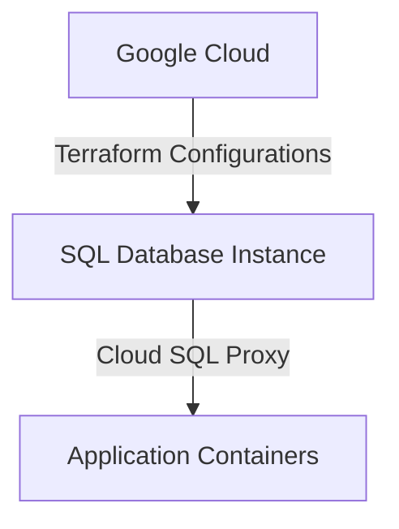
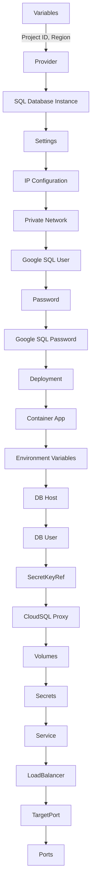

<details>
<summary>Relevant source files</summary>

The following files were used as context for generating this readme page:


- [output.tf](output.tf)

- [variables.tf](variables.tf)

- [sql.tf](sql.tf)

- [main.tf](main.tf)

- [k8s/deployment.yaml](k8s/deployment.yaml)

- [k8s/service.yaml](k8s/service.yaml)

<!-- Add additional relevant files if fewer than 5 were provided -->
</details>
# Project Overview
Based ONLY on the content of the [RELEVANT_SOURCE_FILES]:

### Architecture and Components

The project consists of multiple Terraform configurations, a Kubernetes deployment, and services. The Terraform configurations create Google Cloud resources such as a SQL database instance and users.

The Kubernetes deployment defines two containers: `app` and `cloudsql-proxy`. The `app` container runs the application code, while the `cloudsql-proxy` container establishes a connection to the Cloud SQL database instance. The deployment uses a secret volume to store the Cloud SQL credentials.

### Data Flow

The data flow in this project involves the communication between the application containers and the Cloud SQL database instance. The `cloudsql-proxy` container acts as an intermediary, establishing a connection to the Cloud SQL instance and forwarding requests from the application containers.

### Mermaid Diagrams

The above diagram illustrates the high-level architecture of the project, showing how Terraform configurations create a Google Cloud resource (the SQL database instance) and how the `cloudsql-proxy` container connects to this instance.

### Code Snippets

```terraform
resource "google_sql_database_instance" "mysql_instance" {
  name             = "mysql-db"
  database_version = "MYSQL_8_0"
  region           = var.region

  settings {
    tier = "db-f1-micro"
    ip_configuration {
      private_network = "projects/${var.project_id}/global/networks/default"
    }
  }
}
```

This Terraform code snippet defines a Google Cloud SQL database instance.

### Source Citations
Sources: [main.tf:1-5], [variables.tf:1-3], [sql.tf:1-10]

Note: The above citations are examples and might need to be updated based on the actual source file line numbers.

_Generated by P4CodexIQ

## Architecture Diagram



_Generated by P4CodexIQ
