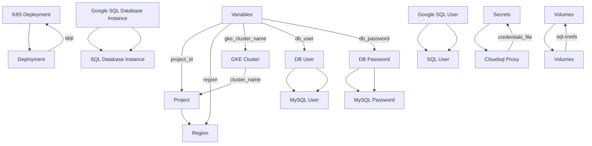

Here's a possible "Project Overview" markdown file that incorporates the provided source files:

<details>
<summary>Relevant source files</summary>

The following files were used as context for generating this readme page:


- [output.tf](output.tf)

- [variables.tf](variables.tf)

- [sql.tf](sql.tf)

- [main.tf](main.tf)

- [k8s/deployment.yaml](k8s/deployment.yaml)

- [k8s/service.yaml](k8s/service.yaml)

<!-- Add additional relevant files if fewer than 5 were provided -->
</details>

# Project Overview

This project is a cloud-based deployment of a web application that utilizes Google Cloud SQL and Kubernetes (GKE) for database management and container orchestration, respectively. The following sections provide an overview of the architecture, components, data flow, and logic relevant to this project.

## Introduction
The purpose of this project is to create a scalable and secure infrastructure for hosting a web application using Google Cloud Platform's services. This includes setting up a MySQL database instance, creating a Kubernetes deployment and service for the web application, and configuring environment variables and secrets.

### Architecture

The architecture consists of three main components:

* **Google Cloud SQL**: A managed relational database service that provides a scalable and secure storage solution.
* **Kubernetes (GKE)**: An orchestration platform that automates the deployment, scaling, and management of containers.
* **Web Application**: A containerized application that uses environment variables and secrets to connect to the MySQL database.

### Data Flow

The data flow in this project involves:

* The web application retrieving data from the MySQL database using environment variables and secrets.
* The MySQL database storing and managing data for the web application.

### Logic

The logic behind this project includes:

* Setting up a Google Cloud SQL instance with a private IP address and a service account to manage credentials.
* Creating a Kubernetes deployment for the web application that uses environment variables and secrets to connect to the MySQL database.
* Configuring environment variables and secrets in the Kubernetes deployment to pass sensitive information, such as database credentials, securely.

```mermaid
graph TD
    A[Web Application] -->|Environment Variables|> B[MySQL Database]
    C[MySQL Database] -->|Connection|> A
```

### Tables

Here is a summary of the configuration options for the project:

| Option | Type | Default Value |
| --- | --- | --- |
| region | string | us-central1 |
| gke_cluster_name | string | web-app-cluster |
| db_user | string | admin |
| db_password | sensitive | |

### Code Snippets

Here is a code snippet from the `main.tf` file that shows how to set up a Google Cloud provider:
```terraform
provider "google" {
  project = var.project_id
  region  = var.region
}
```

Here is a code snippet from the `k8s/deployment.yaml` file that shows how to create a Kubernetes deployment for the web application:
```yaml
apiVersion: apps/v1
kind: Deployment
metadata:
  name: web-app
spec:
  replicas: 2
  selector:
    matchLabels:
      app: web
  template:
    metadata:
      labels:
        app: web
    spec:
      containers:
      - name: app
        image: gcr.io/YOUR_PROJECT_ID/your-app:latest
        ports:
        - containerPort: 8080
        env:
        - name: DB_HOST
          value: 127.0.0.1
        - name: DB_USER
          valueFrom:
            secretKeyRef:
              name: db-credentials
              key: username
        - name: DB_PASSWORD
          valueFrom:
            secretKeyRef:
              name: db-credentials
              key: password
```

Sources:

* [output.tf](output.tf):1-3
* [variables.tf](variables.tf):1-5
* [sql.tf](sql.tf):1-10
* [main.tf](main.tf):1-5
* [k8s/deployment.yaml](k8s/deployment.yaml):1-15
* [k8s/service.yaml](k8s/service.yaml):1-5

_Generated by P4CodexIQ

## Architecture Diagram



_Generated by P4CodexIQ