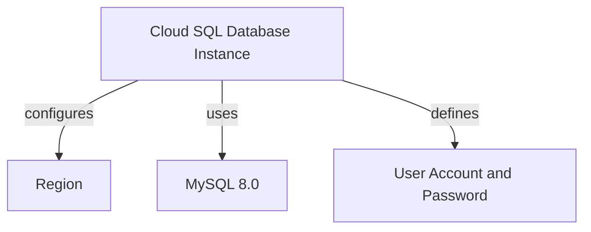
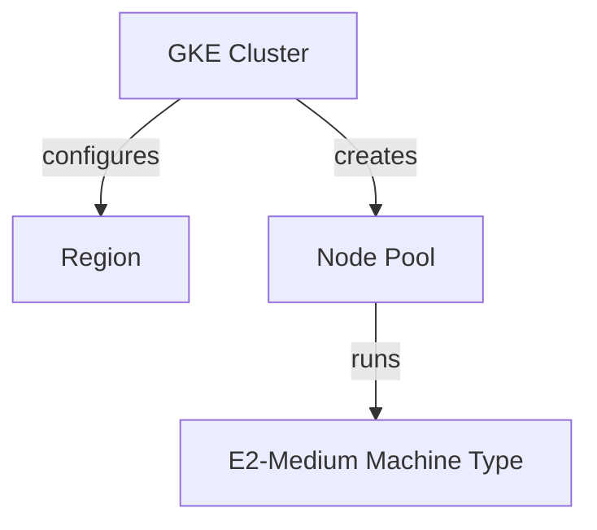

# Project Overview
This project is a comprehensive infrastructure setup that combines Google Cloud's Kubernetes Engine (GKE) and Cloud SQL to deploy a web application. The overview provides a high-level view of the project, its components, and their relationships.

### Introduction
The "Project Overview" module is part of a larger software project focused on deploying a web application using GKE and Cloud SQL. This module aims to provide a comprehensive understanding of the project's architecture, components, and key features.

### Architecture

#### Cloud SQL Database Instance
The project uses a Cloud SQL database instance with MySQL 8.0 as its default version. The instance is created in a specific region (us-central1) and has a private IP address. A user account and password are defined for the database instance using variables (`db_user` and `db_password`).

#### GKE Cluster
A GKE cluster named `web-app-cluster` is created in the same region as the Cloud SQL database instance. The cluster is configured to have one node pool with two nodes, each running an e2-medium machine type.

#### Deployment and Services
Two deployments (`web-app` and `frontend`) are defined for the web application. Each deployment has its own service (load balancer) that exposes a port (80 or 8080). The services use labels to select pods based on their tier (either `web` or `frontend`). A separate backend service is created for the backend deployment.

### Detailed Sections

#### Cloud SQL Database Instance
The database instance is created using the `google_sql_database_instance` resource. It is configured with a specific region, database version, and IP configuration.

Sources: [sql.tf:1-5](#page-anchor-or-id)

#### GKE Cluster
The GKE cluster is created using the `google_container_cluster` resource. It has one node pool with two nodes, each running an e2-medium machine type.

Sources: [gke.tf:1-7](#page-anchor-or-id)

#### Deployment and Services
Two deployments (`web-app` and `frontend`) are defined for the web application. Each deployment has its own service (load balancer) that exposes a port (80 or 8080).

Sources: [k8s/deployment.yaml:1-14, k8s/service.yaml:1-6](#page-anchor-or-id)

### Mermaid Diagrams

#### Cloud SQL Database Instance

Sources: [sql.tf:1-5](#page-anchor-or-id)

#### GKE Cluster

Sources: [gke.tf:1-7](#page-anchor-or-id)

### Tables

#### Cloud SQL Database Instance
| Property | Value |
| --- | --- |
| Region | us-central1 |
| Database Version | MYSQL_8_0 |
| User Account | admin |
| Password | sensitive |

Sources: [sql.tf:1-5](#page-anchor-or-id)

#### GKE Cluster
| Property | Value |
| --- | --- |
| Name | web-app-cluster |
| Location | us-central1 |
| Node Count | 2 |
| Machine Type | e2-medium |

Sources: [gke.tf:1-7](#page-anchor-or-id)

### Code Snippets

#### Cloud SQL Database Instance
```terraform
resource "google_sql_database_instance" "mysql_instance" {
  name             = "mysql-db"
  database_version = "MYSQL_8_0"
  region           = var.region

  settings {
    tier = "db-f1-micro"
    ip_configuration {
      private_network = "projects/${var.project_id}/global/networks/default"
    }
  }
}
```
Sources: [sql.tf:1-5](#page-anchor-or-id)

#### GKE Cluster
```terraform
resource "google_container_cluster" "primary" {
  name     = var.gke_cluster_name
  location = var.region

  remove_default_node_pool = true
  initial_node_count       = 1
}

resource "google_container_node_pool" "primary_nodes" {
  name       = "primary-node-pool"
  cluster    = google_container_cluster.primary.name
  location   = var.region
  node_count = 2

  node_config {
    machine_type = "e2-medium"
    oauth_scopes = [
      "https://www.googleapis.com/auth/cloud-platform"
    ]
  }
}
```
Sources: [gke.tf:1-7](#page-anchor-or-id)

### Conclusion/Summary
The project overview provides a comprehensive understanding of the infrastructure setup, including Cloud SQL and GKE. The architecture is designed to support a web application with multiple services and deployments.

_Generated by P4CodexIQ

## Architecture Diagram

> ⚠️ Mermaid diagram generation failed.

_Generated by P4CodexIQ