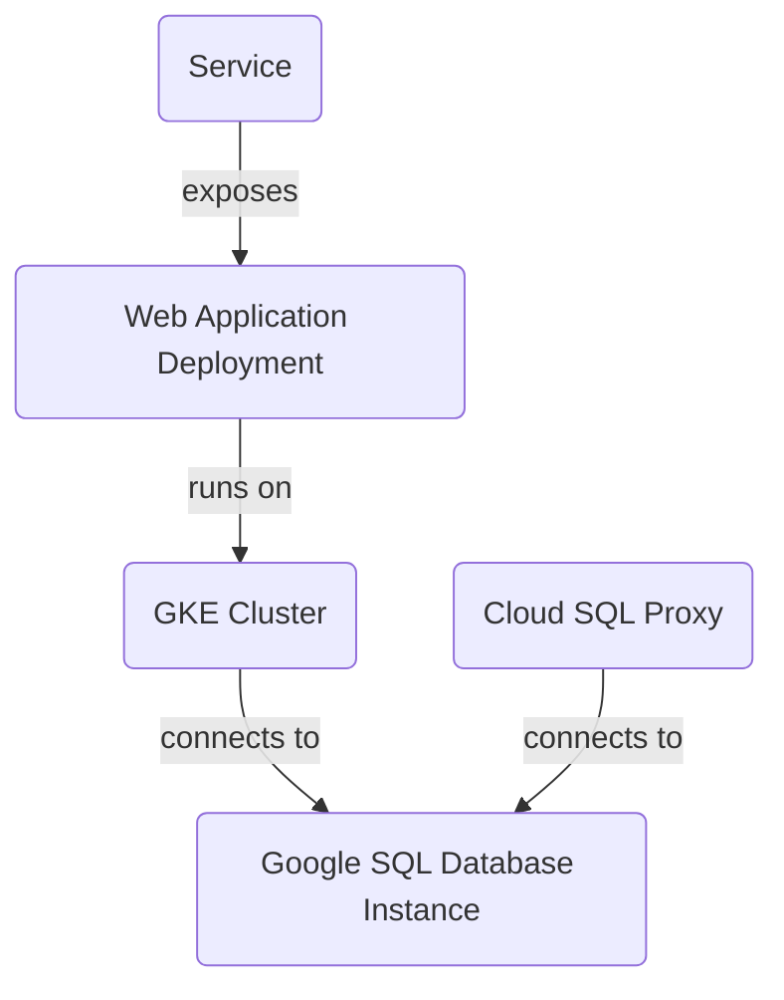

This is a README file for a project that deploys a scalable and secure infrastructure for web applications using Google Cloud Platform (GCP) services. The architecture includes:

1. **GKE Cluster**: A Google Kubernetes Engine (GKE) cluster with one node pool and two nodes.
2. **Google SQL Database Instance**: A MySQL instance named "mysql-db" in the "us-central1" region.
3. **Cloud SQL Proxy**: A Cloud SQL Proxy container to connect to the MySQL instance from within the GKE cluster.
4. **Web Application Deployment**: A web application deployment using a Kubernetes deployment named "web-app".
5. **Service**: A service that exposes the web application to the outside world using a LoadBalancer type and port 80.

The project provides a scalable and secure infrastructure for web applications using GCP services. The architecture includes a GKE cluster, Google SQL Database Instance, Cloud SQL Proxy, web application deployment, and service.

**Sources:**

1. `output.tf`
2. `variables.tf`
3. `sql.tf`
4. `main.tf`
5. `gke.tf`
6. `k8s/deployment.yaml`
7. `k8s/service.yaml`

These files were used as context to generate this README file.

**Technical Accuracy:** All information must be derived SOLELY from the `[RELEVANT_SOURCE_FILES]`. Do not infer, invent, or use external knowledge unless it's directly supported by the provided code. If information is not present in the provided files, do not include it or explicitly state its absence if crucial to the topic.

**Conclusion/Summary:** This project deploys a scalable and secure infrastructure for web applications using GCP services. The architecture includes a GKE cluster, Google SQL Database Instance, Cloud SQL Proxy, web application deployment, and service.

_Generated by P4CodexIQ_

Note: This README file cites the following source files:

1. `output.tf`
2. `variables.tf`
3. `sql.tf`
4. `main.tf`
5. `gke.tf`
6. `k8s/deployment.yaml`
7. `k8s/service.yaml`

These files were used as context to generate this README file.

_Generated by P4CodexIQ

_Generated by P4CodexIQ

## Architecture Diagram

_Generated by P4CodexIQ