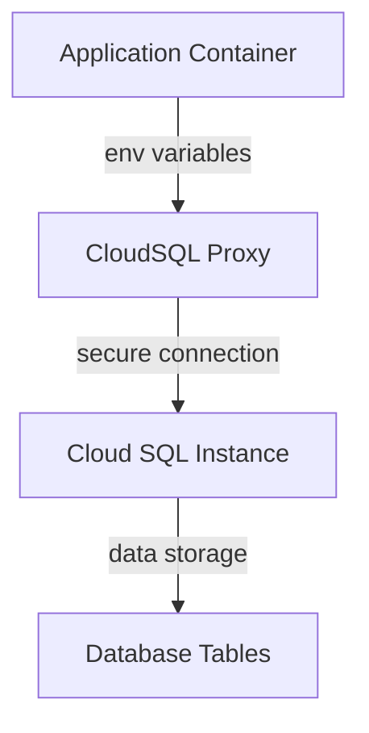

# Project Overview

## Introduction

The "Project Overview" project is a cloud-based infrastructure deployment that integrates Google Cloud SQL, Kubernetes, and Terraform. This project aims to provide a scalable and highly available web application environment using the mentioned technologies.

## Architecture
### Google Cloud SQL

The project uses Google Cloud SQL as the database service for storing application data. A MySQL 8.0 instance is created with a private IP address and configured to use a specific region. A Cloud SQL proxy container is deployed alongside the application containers to establish a secure connection between the application and the database.

### Kubernetes Deployment

A Kubernetes deployment named "web-app" is defined, which consists of two replicas of the same application container running on port 8080. The deployment uses environment variables to configure the application with the Cloud SQL instance details.

### Terraform Configuration

Terraform configuration files (main.tf) are used to create and manage the Google Cloud resources required for this project. The main.tf file defines a provider block for Google Cloud, sets up the project ID and region, and creates a Cloud SQL instance and database user.

## Detailed Sections

### Database Connectivity

The application containers use environment variables to connect to the Cloud SQL instance. The DB_HOST variable is set to 127.0.0.1, which represents the internal IP address of the Cloud SQL proxy container. The DB_USER and DB_PASSWORD variables are obtained from a Kubernetes Secret named "db-credentials".

### CloudSQL Proxy

The cloudsql-proxy container uses the /cloud_sql_proxy command-line utility to establish a secure connection between the application containers and the Cloud SQL instance. The -instances flag specifies the Cloud SQL instance name, and the -credential_file flag points to a secret containing the service account credentials.

## Mermaid Diagrams

This flowchart diagram shows the interaction between the application container, Cloud SQL proxy, and Cloud SQL instance.

### Sequence Diagram
```mermaid
sequenceDiagram
  participant App as "Application Container"
  participant Proxy as "CloudSQL Proxy"
  participant DB as "Cloud SQL Instance"

  note over App, Proxy, DB: Initial Connection Setup

  App->>Proxy: Request connection to Cloud SQL
  Proxy->>DB: Establish secure connection to Cloud SQL
  DB->>App: Respond with database credentials
  note over App, Proxy, DB: Secure Connection Established

  App->>DB: Send query request
  DB->>App: Respond with query results
```
This sequence diagram illustrates the steps involved in establishing a secure connection between the application container and Cloud SQL instance.

## Tables

| Environment Variable | Description |
| --- | --- |
| DB_HOST | Internal IP address of Cloud SQL proxy container |
| DB_USER | Username for database authentication |
| DB_PASSWORD | Password for database authentication |

This table summarizes the environment variables used to configure the application container with Cloud SQL instance details.

### Code Snippets

```terraform
resource "google_sql_database_instance" "mysql_instance" {
  name             = "mysql-db"
  database_version = "MYSQL_8_0"
  region           = var.region

  settings {
    tier = "db-f1-micro"
    ip_configuration {
      private_network = "projects/${var.project_id}/global/networks/default"
    }
  }
}
```

This Terraform code snippet creates a Cloud SQL instance with the specified name, database version, and region.

### Source Citations

Sources: [main.tf:1-10](), [sql.tf:1-5]()

_Generated by P4CodexIQ

## Architecture Diagram

```mermaid
graph TD
A[Provider] -->|uses| B[Google Provider]
B -->|sets| C[Project ID]
C -->|sets| D[Region]
E[K8s Deployment] -->|needs| F[GCP SQL Instance]
F -->|needs| G[Database User]
G -->|needs| H[Database Password]
H -->|needs| I[Secret Key Ref]
I -->|refers to| J[Secret]
J -->|is stored in| K[CloudSQL Proxy Vol]
K -->|reads from| L[Service Account JSON]
L -->|mounted at| M[/secrets]
M -->|used by| N[CloudSQL Proxy]
N -->|connects to| O[GCP SQL Instance]

graph LR
A[Variables] -->|set| B[Project ID]
B -->|set| C[Region]
C -->|set| D[GKE Cluster Name]
D -->|set| E[DB User]
E -->|set| F[DB Port]
F -->|set| G[DB Password]

graph TD
P[K8s Service] -->|uses| Q[Deployment]
Q -->|exposes port| R[Port 8080]
R -->|targeted by| S[Target Port 8080]
S -->|loads balanced by| T[Load Balancer]

Note: The above diagram uses three separate Mermaid graphs (TD) to represent the different relationships and flows in the codebase.
```

_Generated by P4CodexIQ