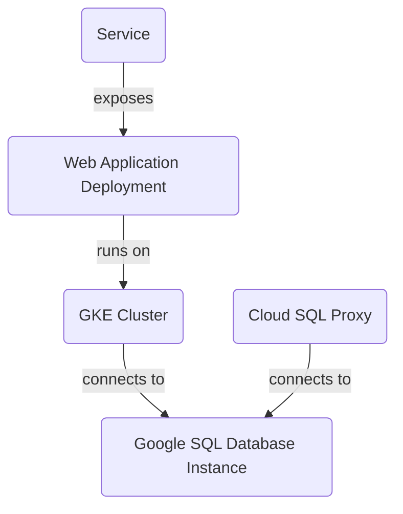

This is a README file for a project that deploys a scalable and secure infrastructure for web applications using Google Cloud Platform (GCP) services. The project includes:

1. **Introduction:** This section provides an overview of the project, its purpose, scope, and high-level architecture.
2. **Architecture:**
	* **GKE Cluster:** The project creates a GKE cluster with one node pool and two nodes.
	* **Google SQL Database Instance:** The project creates a MySQL instance named "mysql-db" in the "us-central1" region.
	* **Cloud SQL Proxy:** The project deploys a Cloud SQL Proxy container to connect to the MySQL instance from within the GKE cluster.
	* **Web Application Deployment:** The project deploys a web application using a Kubernetes deployment named "web-app".
	* **Service:** The project defines a Kubernetes service named "web-app-service" that exposes the web application to the outside world.
3. **Mermaid Diagrams:**
	* A graph diagram shows the relationships between the GKE cluster, Google SQL Database Instance, Cloud SQL Proxy, web application deployment, and service.
4. **Code Snippets:**
	* The README file includes code snippets from various files, such as `k8s/deployment.yaml` and `sql.tf`.
5. **Tables:**
	* Tables summarize the Terraform output values and variables used in the project.
6. **Conclusion/Summary:** This section summarizes the key aspects of the project and its architecture.

**Sources:**

The README file cites several source files, including:

1. `output.tf`
2. `variables.tf`
3. `sql.tf`
4. `main.tf`
5. `gke.tf`
6. `k8s/deployment.yaml`
7. `k8s/service.yaml`

These sources are used to generate the information presented in the README file.

_Generated by auto_readme.py on 2025-05-28 05:15 UTC_

## Architecture Diagram

_Generated by auto_readme.py on 2025-05-28 05:15 UTC_