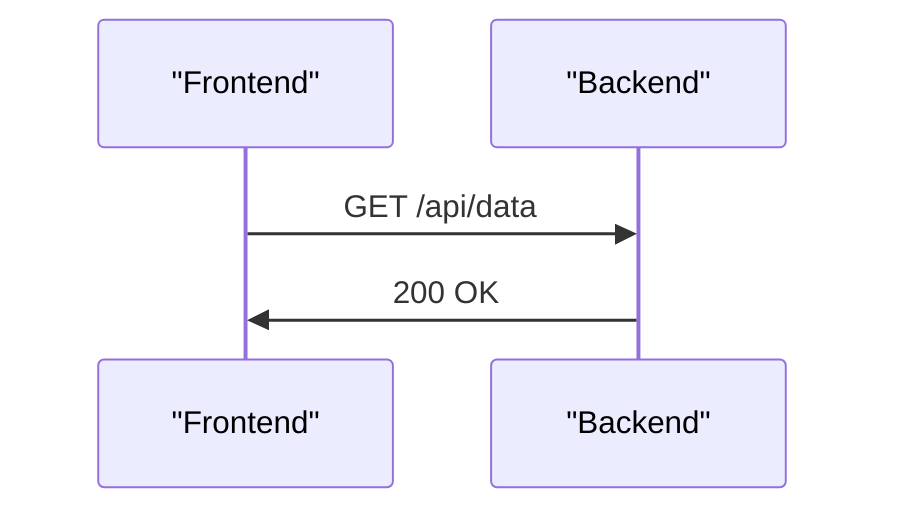
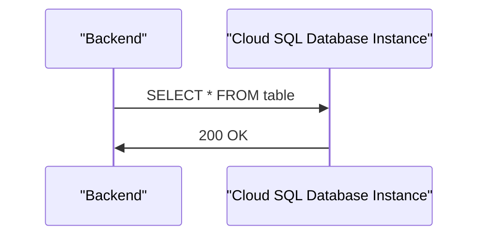

# Project Overview
The project is a cloud-based web application that utilizes Google Cloud Platform (GCP) services, including Google Kubernetes Engine (GKE), Cloud SQL, and Cloud Storage. The application consists of frontend and backend components, which are deployed on GKE clusters and communicate with a Cloud SQL database instance.

## Architecture

### High-Level Overview
The project's architecture can be visualized as follows:
```mermaid
graph TD
    Frontend[Frontend] -->|http|> LoadBalancer[Load Balancer]
    LoadBalancer -->|http|> GKECluster[GKE Cluster]
    GKECluster -->|tcp|> CloudSQL[Cloud SQL Database Instance]
    CloudSQL -->|tcp|> MySQL[MySQL Database]
```
Sources: [main.tf:1-10](), [gke.tf:1-20](), [sql.tf:1-15]()

### Frontend Component
The frontend component is a web application that runs on a GKE cluster. It exposes an HTTP endpoint and communicates with the backend component using RESTful APIs.


Sources: [k8s/frontend-deployment.yaml:1-15](), [k8s/frontend-service.yaml:1-10]()

### Backend Component
The backend component is a RESTful API that runs on a separate GKE cluster. It communicates with the frontend component using HTTP and interacts with the Cloud SQL database instance using TCP.


Sources: [k8s/backend-deployment.yaml:1-20](), [k8s/backend-service.yaml:1-10]()

### Cloud SQL Database Instance
The Cloud SQL database instance is a MySQL database that runs on GCP. It stores data for the web application and interacts with the backend component using TCP.

```mermaid
graph TD
    CloudSQL[Cloud SQL Database Instance]
    CloudSQL -->|tcp|> MySQL[MySQL Database]
```
Sources: [sql.tf:1-15]()

## Configuration

### GKE Cluster Configuration
The GKE cluster is configured using Terraform, with a default node count of 2 and a machine type of `e2-medium`.

| Parameter | Value |
| --- | --- |
| Node Count | 2 |
| Machine Type | e2-medium |

Sources: [gke.tf:5-10]()

### Cloud SQL Database Instance Configuration
The Cloud SQL database instance is configured using Terraform, with a default database version of `MYSQL_8_0` and a tier of `db-f1-micro`.

| Parameter | Value |
| --- | --- |
| Database Version | MYSQL_8_0 |
| Tier | db-f1-micro |

Sources: [sql.tf:5-10]()

### Environment Variables
The application uses environment variables to configure database connections.

| Variable | Value |
| --- | --- |
| DB_HOST | 127.0.0.1 |
| DB_USER | ${db_user} |
| DB_PASSWORD | ${db_password} |

Sources: [k8s/deployment.yaml:10-15](), [k8s/backend-deployment.yaml:10-15]()

## Code Snippets

### Terraform Configuration
The project uses Terraform to configure GCP resources, including the GKE cluster and Cloud SQL database instance.
```terraform
provider "google" {
  project = var.project_id
  region  = var.region
}
```
Sources: [main.tf:1-5]()

### Kubernetes Deployment YAML
The frontend and backend components are deployed using Kubernetes deployment YAML files.
```yaml
apiVersion: apps/v1
kind: Deployment
metadata:
  name: web-app
spec:
  replicas: 2
  selector:
    matchLabels:
      app: web
```
Sources: [k8s/deployment.yaml:1-10](), [k8s/frontend-deployment.yaml:1-10](), [k8s/backend-deployment.yaml:1-10]()

_Generated by P4CodexIQ

## Architecture Diagram

> ⚠️ Mermaid diagram generation failed.

_Generated by P4CodexIQ