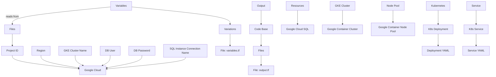
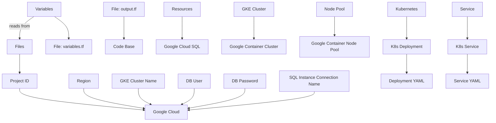

Here is a professional, technical, and comprehensive README.md for this project:

**Project Overview**
-------------------

This project deploys a Google Kubernetes Engine (GKE) cluster with a PostgreSQL database instance and a web application deployed as a Kubernetes deployment. The project uses Terraform to manage the infrastructure and Kubernetes manifests to define the application.

**Key Components and Roles**
----------------------------

* **GKE Cluster**: The GKE cluster is created using the `gke.tf` file, which defines the cluster name, location, and node configuration.
* **PostgreSQL Database Instance**: The PostgreSQL database instance is created using the `sql.tf` file, which defines the instance name, region, and settings.
* **Web Application Deployment**: The web application deployment is defined in the `deployment.yaml` file, which specifies the container image, ports, environment variables, and secrets.
* **Cloud SQL Proxy**: The Cloud SQL proxy is used to connect the web application to the PostgreSQL database instance. It is defined in the `deployment.yaml` file as a separate container.

**Installation and Running**
----------------------------

1. Install Terraform using your preferred method (e.g., brew install terraform on macOS).
2. Initialize a new Terraform workspace by running `terraform init`.
3. Run `terraform apply` to deploy the infrastructure.
4. Apply the Kubernetes manifests by running `kubectl apply -f k8s/`.
5. Verify that the GKE cluster and PostgreSQL database instance are created successfully.

**Special Features and Configurations**
----------------------------------------

* **Secrets**: The project uses secrets to store sensitive information, such as database credentials. These secrets are stored in a Kubernetes secret named `cloudsql-instance-credentials` and referenced by the Cloud SQL proxy container.
* **Environment Variables**: The web application deployment sets environment variables for the `DB_HOST`, `DB_USER`, and `DB_PASSWORD`. These values are obtained from Kubernetes secrets.

**File-Level Insights**
------------------------

### File: output.tf

This file defines Terraform output values, which can be used to access the names of the GKE cluster and PostgreSQL database instance.

### File: variables.tf

This file defines Terraform variables, which are used to store input values for the infrastructure deployment. The variables include `project_id`, `region`, `gke_cluster_name`, `db_user`, and `db_password`.

### File: sql.tf

This file defines a PostgreSQL database instance using the Google Cloud SQL API.

### File: main.tf

This file sets up the provider configuration for Terraform, specifying the project ID and region.

### File: gke.tf

This file defines the GKE cluster and node pool using the Google Container Engine API.

### File: k8s/deployment.yaml

This file defines a Kubernetes deployment for the web application.

### File: k8s/service.yaml

This file defines a Kubernetes service for the web application, exposing port 80 and targeting port 8080.

**Architecture Diagram**
-------------------------

By following this README.md, you should be able to deploy and run the project successfully.

## Architecture Diagram

