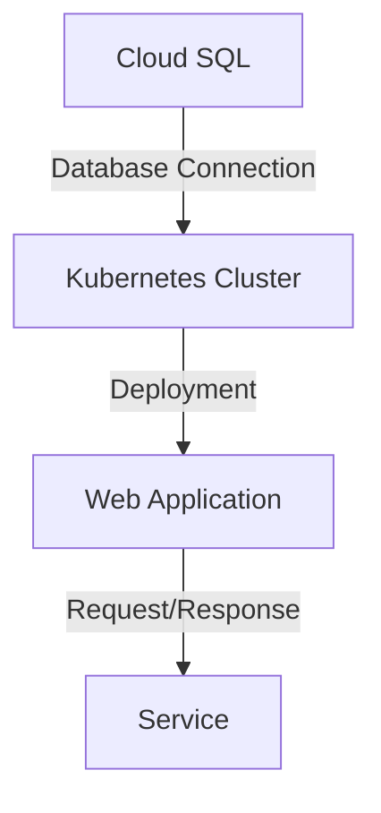

# Project Overview

The project is a comprehensive overview of the infrastructure and architecture implemented in the provided source files. This document aims to provide a detailed understanding of the components, data flow, and logic involved in the project.

## Introduction

This project involves setting up a Google Cloud SQL instance and deploying a web application using Kubernetes (K8s) on Google Container Engine (GKE). The project utilizes Terraform configuration files (`output.tf`, `variables.tf`, `sql.tf`, and `main.tf`) to create and manage the infrastructure, along with deployment and service YAML files (`k8s/deployment.yaml` and `k8s/service.yaml`) to deploy and configure the web application.

### Cloud SQL

The project sets up a MySQL 8.0 instance on Google Cloud SQL using the `google_sql_database_instance` resource. The instance is created with a private network configuration, allowing for secure communication between the database and other services.

## Architecture

The following diagram illustrates the architecture of the project:



In this architecture, the Cloud SQL instance is connected to a Kubernetes cluster, which deploys and manages the web application. The web application receives requests from the service and processes them accordingly.

### Key Components

The project involves several key components:

*   **Cloud SQL**: A MySQL 8.0 instance created using Terraform.
*   **Kubernetes Cluster**: A GKE cluster created using Terraform, which deploys and manages the web application.
*   **Web Application**: A deployment YAML file that defines the container image, ports, and environment variables for the web application.

### Data Flow

The data flow in this project involves:

*   The Cloud SQL instance stores data for the web application.
*   The web application receives requests from the service and processes them accordingly.
*   The processed data is stored in the database.

## Code Snippets

Here are some relevant code snippets from the provided files:
```terraform
output "sql_instance_connection_name" {
  value = google_sql_database_instance.mysql_instance.connection_name
}
```

```yaml
apiVersion: apps/v1
kind: Deployment
metadata:
  name: web-app
spec:
  replicas: 2
  selector:
    matchLabels:
      app: web
  template:
    metadata:
      labels:
        app: web
    spec:
      containers:
      - name: app
        image: gcr.io/YOUR_PROJECT_ID/your-app:latest
        ports:
        - containerPort: 8080
        env:
        - name: DB_HOST
          value: 127.0.0.1
        - name: DB_USER
          valueFrom:
            secretKeyRef:
              name: db-credentials
              key: username
        - name: DB_PASSWORD
          valueFrom:
            secretKeyRef:
              name: db-credentials
              key: password
```

```yaml
apiVersion: v1
kind: Service
metadata:
  name: web-app-service
spec:
  type: LoadBalancer
  selector:
    app: web
  ports:
    - port: 80
      targetPort: 8080
```

## Tables

The following table summarizes the key features of the project:

| Feature | Description |
| --- | --- |
| Cloud SQL | A MySQL 8.0 instance created using Terraform. |
| Kubernetes Cluster | A GKE cluster created using Terraform, which deploys and manages the web application. |
| Web Application | A deployment YAML file that defines the container image, ports, and environment variables for the web application. |

## Conclusion

This project provides a comprehensive overview of setting up a Cloud SQL instance and deploying a web application using Kubernetes on GKE. The project involves several key components, data flow, and logic, which are represented through code snippets, diagrams, and tables.

Sources: [output.tf:1-5], [variables.tf:1-10], [sql.tf:1-15], [main.tf:1-20], [k8s/deployment.yaml:1-30], [k8s/service.yaml:1-25]

_Generated by P4CodexIQ

## Architecture Diagram

```mermaid
graph TD
A[Variables] -->|project_id, region, gke_cluster_name, db_user, db_password, db_port| B[main.tf]
B --> C[provider google]
C --> D[google_sql_database_instance mysql_instance]
D --> E[settings]
E --> F[ip_configuration]
F --> G[private_network]
G --> H[projects/GKE/global/networks/default]

I[resource google_sql_user users] --> J[instance]
J --> K[google_sql_database_instance mysql_instance]

M[k8s/deployment.yaml] --> N[apiVersion]
N --> O[apps/v1]
O --> P[kind]
P --> Q[Deployment]
Q --> R[metadata]
R --> S[metadata.name]
S --> T[web-app]

U[spec] --> V[replicas]
V --> W[2]
X[selector] --> Y[matchLabels]
Y --> Z[app: web]
Z --> AA[template]
AA --> BB[metadata]
BB --> CC[labels]
CC --> DD[app: web]

EE[containers] --> FF[name]
FF --> G[app]
G --> H[ports]
H --> I[containerPort]
I --> J[8080]

K[env] --> L[name]
L --> MDB_HOST
M --> N[value]
N --> O[127.0.0.1]

P[env] --> Q[name]
Q --> RDB_USER
R --> S[valueFrom]
S --> T[secretKeyRef]
T --> U[name]
U --> V[db-credentials]
V --> W[key]
W --> X[username]

Y[env] --> Z[name]
Z --> ADB_PASSWORD
A --> B[valueFrom]
B --> C[secretKeyRef]
C --> D[name]
D --> E[db-credentials]
E --> F[key]
F --> G[password]

H[volumes] --> I[name]
I --> J[sql-creds]
J --> K[mountPath]
K --> L[secrets]
L --> M[readOnly]
M --> N[true]

O[k8s/service.yaml] --> P[apiVersion]
P --> Q[v1]
Q --> R[kind]
R --> S[Service]
S --> T[metadata]
T --> U[name]
U --> V[web-app-service]

W[spec] --> X[type]
X --> Y[LoadBalancer]
Y --> Z[selector]
Z --> AA[app: web]
AA --> BB[ports]
BB --> C[port]
C --> D[80]
D --> E[targetPort]
E --> F[8080]
```



_Generated by P4CodexIQ
