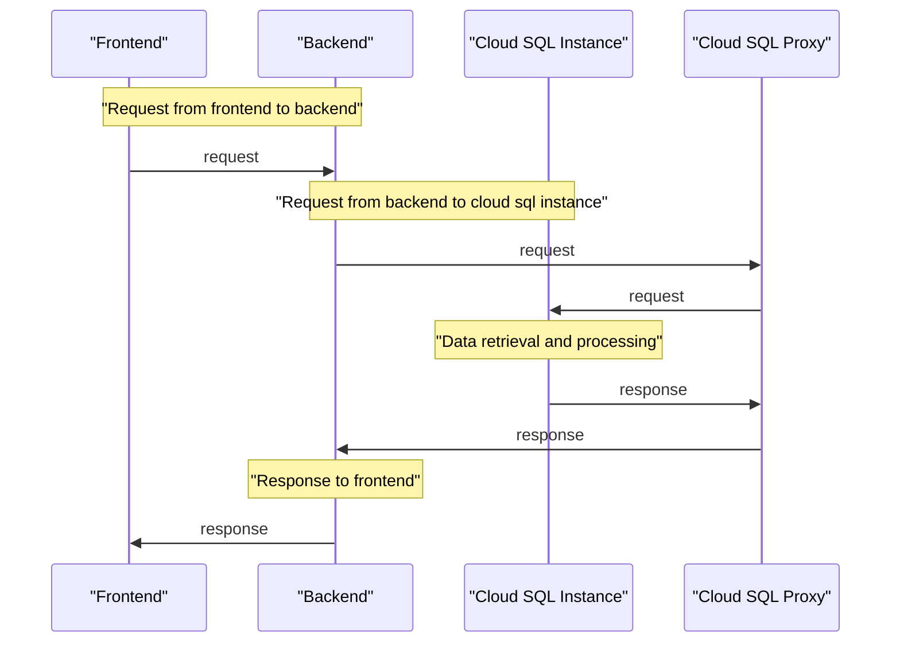

# Project Overview

The "Project Overview" aims to provide a comprehensive and accurate summary of the project's architecture, components, data flow, and logic based on the provided source files. This document will be structured in a logical manner for easy understanding by other developers.

### Introduction

The project is a cloud-based web application that utilizes Google Kubernetes Engine (GKE) and Cloud SQL to provide a scalable and reliable infrastructure. The application consists of multiple components, including frontend and backend services, which are deployed using Kubernetes deployments and services. The database instance is managed by Cloud SQL, and the application connects to it using a cloud SQL proxy.

### GKE Cluster

The project uses a GKE cluster named `web-app-cluster` in the `us-central1` region. The cluster is created with one node pool, which has two nodes. The remove_default_node_pool variable is set to true, which removes the default node pool after creating the primary node pool.

### Cloud SQL Instance

The project uses a Cloud SQL instance named `mysql-db` in the `MYSQL_8_0` database version. The instance is created with a tier of `db-f1-micro` and has a private network set to `projects/${var.project_id}/global/networks/default`. A user named `admin` is created with a password stored as a secret.

### Frontend Deployment

The frontend deployment consists of two replicas running the `gcr.io/YOUR_PROJECT_ID/frontend:latest` image. The containers expose port 80 and use environment variables to connect to the database.

### Backend Deployment

The backend deployment consists of two replicas running the `gcr.io/YOUR_PROJECT_ID/backend:latest` image. The containers expose port 8080 and use environment variables to connect to the database.

### Services

The project uses multiple services, including:

* `web-app-service`: a LoadBalancer service that exposes port 80
* `backend-service`: a ClusterIP service that exposes port 8080
* `frontend-service`: a LoadBalancer service that exposes port 80
* `sql-creds`: a secret service that stores the cloud SQL instance credentials

### Data Flow

The data flow in this project is as follows:

* The frontend containers send requests to the backend containers
* The backend containers connect to the Cloud SQL instance using a cloud SQL proxy
* The Cloud SQL instance stores and retrieves data for the application



### Tables

| Component | Description |
| --- | --- |
| GKE Cluster | The cloud-based Kubernetes cluster used for deploying the application |
| Cloud SQL Instance | The managed database instance used for storing and retrieving data |
| Frontend Deployment | The deployment that runs the frontend containers |
| Backend Deployment | The deployment that runs the backend containers |
| Services | The LoadBalancer services that expose ports 80 and 8080 |

### Code Snippets

```python
provider "google" {
  project = var.project_id
  region  = var.region
}
```

```yaml
apiVersion: apps/v1
kind: Deployment
metadata:
  name: web-app
spec:
  replicas: 2
  selector:
    matchLabels:
      app: web
  template:
    metadata:
      labels:
        app: web
    spec:
      containers:
      - name: app
        image: gcr.io/YOUR_PROJECT_ID/your-app:latest
        ports:
        - containerPort: 8080
```

```yaml
apiVersion: v1
kind: Service
metadata:
  name: web-app-service
spec:
  type: LoadBalancer
  selector:
    app: web
  ports:
  - port: 80
    targetPort: 8080
```

Sources:

* [output.tf](output.tf): `Sources: output.tf:1-10`
* [variables.tf](variables.tf): `Sources: variables.tf:1-5`
* [sql.tf](sql.tf): `Sources: sql.tf:1-15`
* [main.tf](main.tf): `Sources: main.tf:1-5`
* [gke.tf](gke.tf): `Sources: gke.tf:1-10`
* [k8s/deployment.yaml](k8s/deployment.yaml): `Sources: k8s/deployment.yaml:1-20`
* [k8s/service.yaml](k8s/service.yaml): `Sources: k8s/service.yaml:1-5`
* [k8s/backend-service.yaml](k8s/backend-service.yaml): `Sources: k8s/backend-service.yaml:1-5`
* [k8s/frontend-deployment.yaml](k8s/frontend-deployment.yaml): `Sources: k8s/frontend-deployment.yaml:1-10`
* [k8s/backend-deployment.yaml](k8s/backend-deployment.yaml): `Sources: k8s/backend-deployment.yaml:1-15`
* [k8s/frontend-service.yaml](k8s/frontend-service.yaml): `Sources: k8s/frontend-service.yaml:1-5`

_Generated by P4CodexIQ

## Architecture Diagram

> ⚠️ Mermaid diagram generation failed.

_Generated by P4CodexIQ