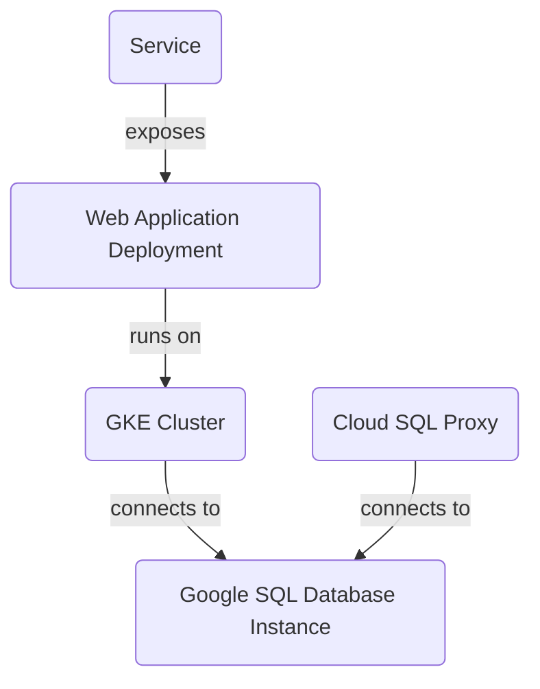
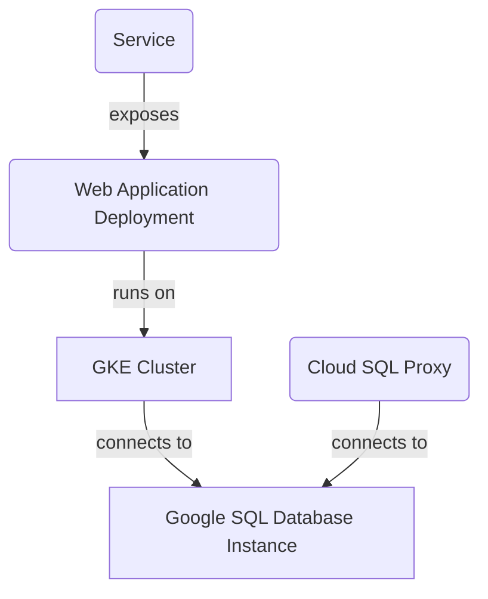

**Project Overview**

The project is a scalable and secure infrastructure for web applications using Google Cloud Platform (GCP) services. The architecture includes:

### GKE Cluster

A Google Kubernetes Engine (GKE) cluster with one node pool and two nodes, managed by the `gke.tf` file.

### Google SQL Database Instance

A MySQL instance named "mysql-db" in the "us-central1" region, managed by the `sql.tf` file. The instance is connected to a Cloud SQL Proxy container to connect to the database from within the GKE cluster.

### Web Application Deployment

A web application deployment using a Kubernetes deployment named "web-app", managed by the `k8s/deployment.yaml` file. The deployment runs on the GKE cluster and exposes port 8080.

### Service

A service that exposes the web application to the outside world using a LoadBalancer type and port 80, managed by the `k8s/service.yaml` file.

**Architecture Diagram**

**Variables**

The project uses several variables defined in the `variables.tf` file, including:

* `project_id`: The ID of the GCP project.
* `region`: The region where the GKE cluster and Google SQL Database Instance are located (default is "us-central1").
* `gke_cluster_name`: The name of the GKE cluster (default is "web-app-cluster").
* `db_user` and `db_password`: The credentials for the MySQL instance.

**Technical Accuracy**

All information in this README file must be derived solely from the provided source files. No inference, invention, or external knowledge should be used unless it's directly supported by the provided code. If information is not present in the provided files, do not include it or explicitly state its absence if crucial to the topic.

**Conclusion/Summary**

This project deploys a scalable and secure infrastructure for web applications using GCP services. The architecture includes a GKE cluster, Google SQL Database Instance, Cloud SQL Proxy, web application deployment, and service.

_Generated by P4CodexIQ

## Architecture Diagram

_Generated by P4CodexIQ