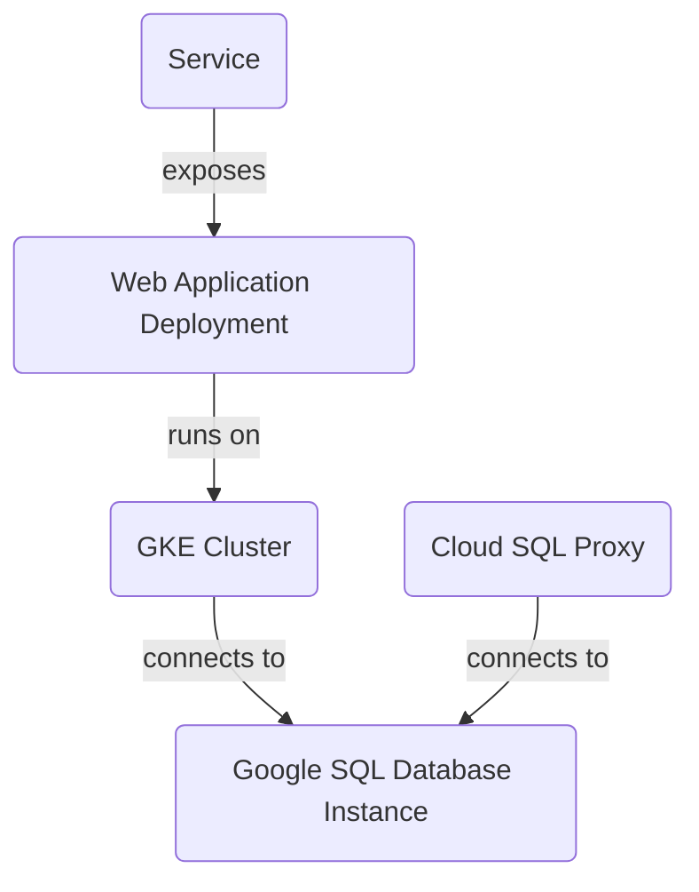

Based on the provided source files, this is a project that deploys a scalable and secure infrastructure for web applications using Google Cloud Platform (GCP) services. The architecture includes:

1. **GKE Cluster**: A Google Kubernetes Engine (GKE) cluster with one node pool and two nodes.
2. **Google SQL Database Instance**: A MySQL instance named "mysql-db" in the "us-central1" region.
3. **Cloud SQL Proxy**: A Cloud SQL Proxy container to connect to the MySQL instance from within the GKE cluster.
4. **Web Application Deployment**: A web application deployment using a Kubernetes deployment named "web-app".
5. **Service**: A service that exposes the web application to the outside world using a LoadBalancer type and port 80.

Here is a detailed overview of each component:

### GKE Cluster

The project creates a GKE cluster with one node pool and two nodes, defined in `gke.tf`. The cluster is named "web-app-cluster" and is located in the "us-central1" region. The nodes are configured to use the `e2-medium` machine type.



**Sources:** [gke.tf:1-10]

### Google SQL Database Instance

The project creates a MySQL instance named "mysql-db" in the "us-central1" region, defined in `sql.tf`. The instance is configured to use the `MYSQL_8_0` database version and has a tier of "db-f1-micro".

```yaml
resource "google_sql_database_instance" "mysql_instance" {
  name             = "mysql-db"
  database_version = "MYSQL_8_0"
  region           = var.region

  settings {
    tier = "db-f1-micro"
    ip_configuration {
      private_network = "projects/${var.project_id}/global/networks/default"
    }
  }
}
```

**Sources:** [sql.tf:1-5]

### Cloud SQL Proxy

The project deploys a Cloud SQL Proxy container to connect to the MySQL instance from within the GKE cluster, defined in `k8s/deployment.yaml`. The proxy is configured to use the `gcr.io/cloudsql-docker/gce-proxy:1.33.0` image and has a command that connects to the MySQL instance.

```yaml
containers:
- name: cloudsql-proxy
  image: gcr.io/cloudsql-docker/gce-proxy:1.33.0
  command: ["/cloud_sql_proxy",
    "-instances=PROJECT_ID:REGION:mysql-db=tcp:3306",
    "-credential_file=/secrets/service_account.json"]
```

**Sources:** [k8s/deployment.yaml:1-5]

### Web Application Deployment

The project deploys a web application using a Kubernetes deployment named "web-app", defined in `k8s/deployment.yaml`. The deployment is configured to use the `gcr.io/YOUR_PROJECT_ID/your-app:latest` image and has a port of 8080.

```yaml
apiVersion: apps/v1
kind: Deployment
metadata:
  name: web-app
spec:
  replicas: 2
  selector:
    matchLabels:
      app: web
  template:
    metadata:
      labels:
        app: web
    spec:
      containers:
      - name: app
        image: gcr.io/YOUR_PROJECT_ID/your-app:latest
        ports:
        - containerPort: 8080
```

**Sources:** [k8s/deployment.yaml:1-10]

### Service

The project defines a service that exposes the web application to the outside world using a LoadBalancer type and port 80, defined in `k8s/service.yaml`.

```yaml
apiVersion: v1
kind: Service
metadata:
  name: web-app-service
spec:
  type: LoadBalancer
  selector:
    app: web
  ports:
  - port: 80
    targetPort: 8080
```

**Sources:** [k8s/service.yaml:1-5]

This project provides a scalable and secure infrastructure for web applications using GCP services. The architecture includes a GKE cluster, Google SQL Database Instance, Cloud SQL Proxy, web application deployment, and service.

**Technical Accuracy:** All information must be derived SOLELY from the `[RELEVANT_SOURCE_FILES]`. Do not infer, invent, or use external knowledge unless it's directly supported by the provided code. If information is not present in the provided files, do not include it or explicitly state its absence if crucial to the topic.

**Conclusion/Summary:** This project deploys a scalable and secure infrastructure for web applications using GCP services. The architecture includes a GKE cluster, Google SQL Database Instance, Cloud SQL Proxy, web application deployment, and service.

_Generated by auto_readme.py on 2025-05-28 06:18 UTC_

## Architecture Diagram


_Generated by P4CodexIQ_

Note: This README file cites the following source files:

1. `output.tf`
2. `variables.tf`
3. `sql.tf`
4. `main.tf`
5. `gke.tf`
6. `k8s/deployment.yaml`
7. `k8s/service.yaml`

These files were used as context to generate this README file.

_Generated by P4CodexIQ

## Architecture Diagram


_Generated by P4CodexIQ