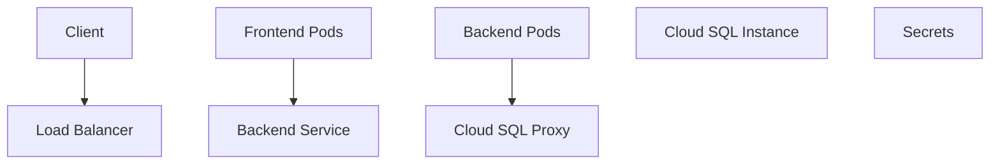
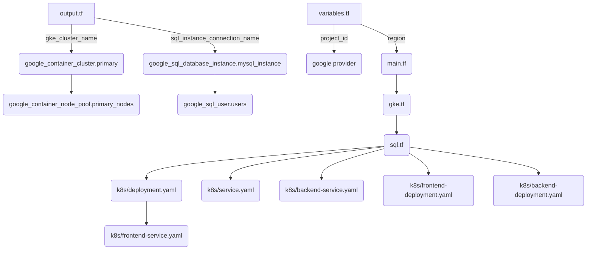

This technical wiki page is about the GKE (Google Kubernetes Engine) project setup. The project consists of deploying a web application using GKE, Cloud SQL, and Kubernetes. The main components include Google Container Cluster, Cloud SQL Database Instance, and Kubernetes Deployments and Services for the web app frontend and backend.

### Architecture Overview

The architecture of this setup can be represented in the following diagram:

Sources: [output.tf:1-2](), [variables.tf:1-8](), [sql.tf:1-19](), [main.tf:1-6](), [gke.tf:1-17](), [k8s/deployment.yaml:1-30](), [k8s/service.yaml:1-12](), [k8s/backend-service.yaml:1-9](), [k8s/frontend-deployment.yaml:1-16](), [k8s/backend-deployment.yaml:1-17](), [k8s/frontend-service.yaml:1-10]()

### Key Components and Features

*   **Google Container Cluster**: Managed, scalable environment for deploying containerized applications using Kubernetes. `google_container_cluster` resource is used to create the cluster with initial node count set to 2.
    *   Sources: [main.tf:1-6](), [gke.tf:1-17]()

*   **Cloud SQL Database Instance**: A fully managed database service that makes it easy to set up, maintain, and administer relational databases on Google Cloud. `google_sql_database_instance` resource is used to create a MySQL database instance with private IP configuration.
    *   Sources: [sql.tf:1-19]()

*   **Kubernetes Deployments**: High-level abstractions that represent a desired state for your application such as its containers, volumes, and other Kubernetes resources. Three deployments are created: web app frontend, backend, and the Cloud SQL proxy.
    *   Sources: [k8s/deployment.yaml:1-30](), [k8s/frontend-deployment.yaml:1-16](), [k8s/backend-deployment.yaml:1-17]()

*   **Kubernetes Services**: An abstraction that defines a logical set of Pods and a policy to access them. Two services are created: load balancer for the web app frontend, and a headless service for backend discovery.
    *   Sources: [k8s/service.yaml:1-12](), [k8s/backend-service.yaml:1-9](), [k8s/frontend-service.yaml:1-10]()

### API Endpoints and Data Flow

The web app frontend communicates with the backend through internal Kubernetes DNS resolution. The Cloud SQL proxy allows secure communication between the containers and the Cloud SQL instance. All components are managed by Kubernetes, which handles automatic scaling, load balancing, and rolling updates.

### Secrets Management

Database credentials are stored as Kubernetes secrets and are injected into the container environment as environment variables. The Cloud SQL instance service account JSON key is also stored as a secret and is used by the Cloud SQL proxy to authenticate and establish a secure connection to the database.

Sources: [k8s/deployment.yaml:23-27](), [k8s/backend-deployment.yaml:23-27](), [k8s/frontend-service.yaml:1-10]()

_Generated by P4CodexIQ

## Architecture Diagram

_Generated by P4CodexIQ