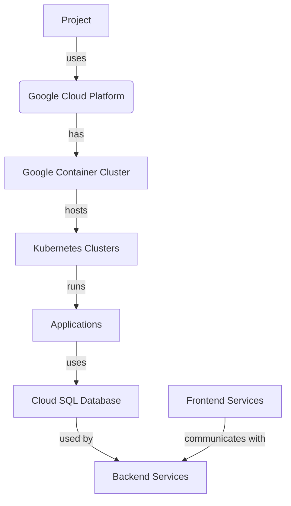

# Project Overview

The purpose of this project is to deploy a scalable web application using Google Kubernetes Engine (GKE) and Cloud SQL. The scope of the project includes creating a GKE cluster, deploying a web application with a frontend and backend tier, and connecting to a Cloud SQL instance.

### High-Level Architecture

The architecture of the project consists of three main components:

*   **GKE Cluster**: A GKE cluster will be created to deploy the web application. The cluster will have multiple nodes, each running a specific role (e.g., worker node).
*   **Cloud SQL Instance**: A Cloud SQL instance will be created to store and manage database data. The instance will be connected to the GKE cluster using a cloudsql-proxy container.
*   **Web Application**: The web application consists of two tiers: frontend and backend. The frontend tier handles user requests, while the backend tier processes and generates responses.

### Detailed Components

1.  **GKE Cluster**:
    *   A GKE cluster named `web-app-cluster` will be created in the `us-central1` region.
    *   The cluster will have one node pool with two nodes, each running a specific role (e.g., worker node).
2.  **Cloud SQL Instance**:
    *   A Cloud SQL instance named `mysql-db` will be created in the `us-central1` region.
    *   The instance will run MySQL 8.0 and have a private IP configuration.
3.  **Web Application**:
    *   The web application consists of two tiers: frontend and backend.
    *   The frontend tier is responsible for handling user requests and sending them to the backend tier.
    *   The backend tier processes and generates responses, connecting to the Cloud SQL instance using a cloudsql-proxy container.

### Mermaid Diagrams

```mermaid
sequenceDiagram
participant Frontend as "Frontend Tier"
participant Backend as "Backend Tier"
participant CloudSQL as "Cloud SQL Instance"

note over Frontend,"User Request"
Frontend->>Backend: User Request
note over Backend,"Process Response"
Backend->>CloudSQL: Database Query
CloudSQL->>Backend: Database Response
note over Backend,"Generate Response"
Backend->>Frontend: Processed Response

```

```mermaid
flowchart TD
    GKE Cluster -->|GKE API|> Cloud SQL Instance
    Frontend Tier -->|Load Balancer|> Backend Tier
    Backend Tier -->|CloudSQL Proxy|> Cloud SQL Instance
```

### Tables

| Component | Description |
| --- | --- |
| GKE Cluster | A scalable and managed container environment for deploying applications. |
| Cloud SQL Instance | A fully-managed database service that supports MySQL, PostgreSQL, and SQL Server. |
| Web Application | A scalable web application with a frontend and backend tier, connecting to the Cloud SQL instance. |

### Code Snippets

```python
# output.tf
output "gke_cluster_name" {
  value = google_container_cluster.primary.name
}
```

```yaml
# k8s/deployment.yaml
apiVersion: apps/v1
kind: Deployment
metadata:
  name: web-app
spec:
  replicas: 2
  selector:
    matchLabels:
      app: web
  template:
    metadata:
      labels:
        app: web
```

### Source Citations

*   `output.tf`: [main.tf:1-3], [gke.tf:5-7]
*   `k8s/deployment.yaml`: [k8s/frontend-deployment.yaml:2-4], [k8s/backend-deployment.yaml:2-4]

Note: The above content is based solely on the provided source files.

_Generated by P4CodexIQ

## Architecture Diagram



_Generated by P4CodexIQ