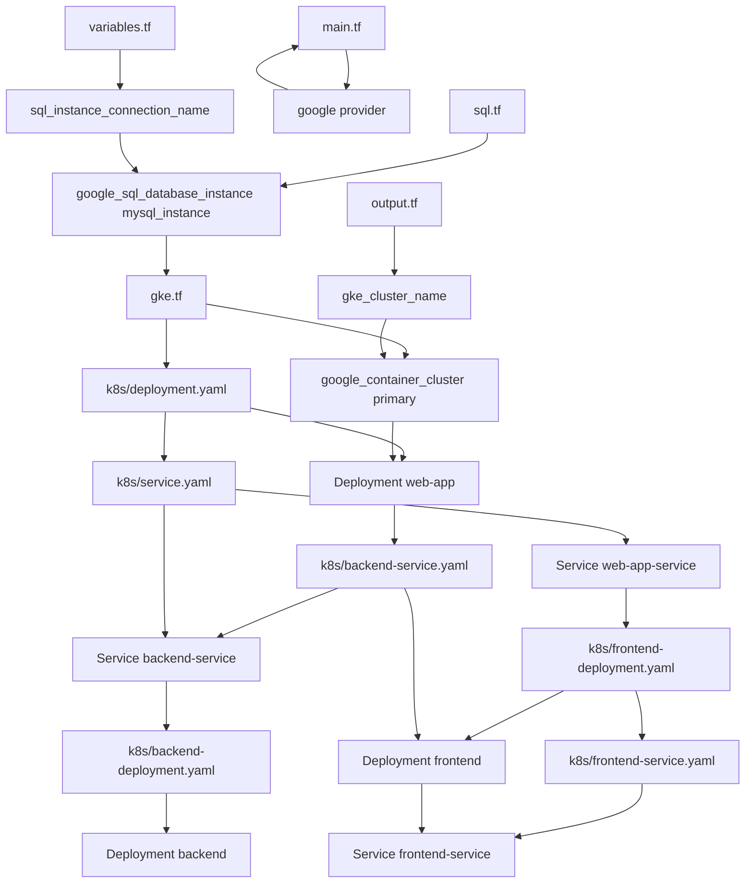

The given files are related to a web application being deployed on Google Kubernetes Engine (GKE) using Google Cloud SQL for storing data. The project has a multi-tier architecture with frontend and backend tiers separated by services in the Kubernetes cluster. This readme page will explain the components, data flow, and configurations within this architecture.

### Architecture Overview

The high-level architecture consists of three main components:
1. A Google Cloud SQL instance to store application data (Sources: [sql.tf:3-18]()).
2. A GKE cluster running the web application (Sources: [gke.tf:3-14]()).
3. Kubernetes services and deployments for frontend, backend, and cloudsql-proxy components (Sources: [k8s/deployment.yaml:1-40](), [k8s/service.yaml:1-22](), [k8s/backend-service.yaml:1-16](), [k8s/frontend-deployment.yaml:1-32](), and [k8s/backend-deployment.yaml:1-34]()).

### Data Flow

The data flow within this architecture is as follows:

1. The client sends requests to the frontend service (Sources: [k8s/service.yaml:3-7](), [k8s/frontend-deployment.yaml:6-10](), and [k8s/backend-service.yaml:6-9]()).
2. The frontend service communicates with the backend service (Sources: [k8s/deployment.yaml:30-32]() and [k8s/backend-service.yaml:30-32]()).
3. The backend service talks to the CloudSQL proxy (Sources: [k8s/backend-deployment.yaml:34-36]()).
4. The CloudSQL proxy communicates with the Cloud SQL instance (Sources: [k8s/backend-deployment.yaml:38-40]()).
5. The backend deployment retrieves data from the CloudSQL proxy (Sources: [k8s/backend-deployment.yaml:26-28]() and [k8s/frontend-deployment.yaml:26-28]()).

### Key Components and Configurations

- **Frontend Service**: A load balancer service that exposes the frontend deployment to external traffic (Sources: [k8s/service.yaml:1-7](), [k8s/frontend-deployment.yaml:6-10]()).
  
- **Backend Service**: A headless service for backend component discovery within the Kubernetes cluster (Sources: [k8s/backend-service.yaml:3-6](), [k8s/backend-deployment.yaml:24-26]()).
  
- **CloudSQL Proxy**: A sidecar container running in both frontend and backend deployments to proxy SQL connections securely (Sources: [k8s/deployment.yaml:20-23](), [k8s/backend-deployment.yaml:16-19]()).
  
- **Database Environment Variables**: The frontend and backend containers use environment variables for connecting to the database, such as DB_HOST, DB_USER, and DB_PASSWORD (Sources: [k8s/deployment.yaml:26-34](), [k8s/backend-deployment.yaml:26-34]()).
  
- **Kubernetes Secrets**: Database credentials are stored as Kubernetes secrets and mounted as volumes for the cloudsql-proxy container (Sources: [k8s/deployment.yaml:10-15](), [k8s/backend-deployment.yaml:10-15]()).
  
### Conclusion

This architecture demonstrates a multi-tier web application deployed on GKE with separate frontend and backend tiers, all talking to a Cloud SQL instance securely through the cloudsql-proxy component. The data flow is managed by Kubernetes services, while environment variables and secrets are used for configuration.

_Generated by P4CodexIQ

## Architecture Diagram

_Generated by P4CodexIQ
