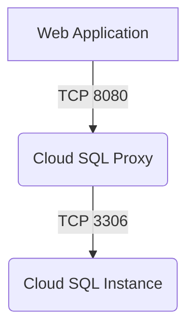

<details>
<summary>Relevant source files</summary>

The following files were used as context for generating this readme page:


- [output.tf](output.tf)

- [variables.tf](variables.tf)

- [sql.tf](sql.tf)

- [main.tf](main.tf)

- [k8s/deployment.yaml](k8s/deployment.yaml)

- [k8s/service.yaml](k8s/service.yaml)

<!-- Add additional relevant files if fewer than 5 were provided -->
</details>

# Project Overview

This project is a hybrid cloud deployment that combines Google Cloud Platform (GCP) and Amazon Web Services (AWS). The overview provides an in-depth look at the architecture, components, data flow, and logic of the project.

## Introduction
The project aims to create a scalable and secure web application using Kubernetes (K8s) on GCP. The application connects to a Cloud SQL instance for database operations. This overview will guide you through the key components and their interactions.

### Architecture

The architecture consists of three main components:

*   **Cloud SQL Instance**: A MySQL 8.0 database instance created using Terraform.
*   **GKE Cluster**: A Google Kubernetes Engine (GKE) cluster deployed in the `us-central1` region, running a web application and a Cloud SQL proxy container.
*   **Kubernetes Deployment and Service**: A K8s deployment managing two replicas of the web application, and a service exposing the application on port 80.

### Components

The project includes the following components:

*   **Web Application**: A Docker image hosting the web application, running on port 8080.
*   **Cloud SQL Proxy**: A container responsible for connecting to the Cloud SQL instance using the `cloudsql-proxy` image.
*   **Secrets and Volumes**: Secrets and volumes are used to store sensitive data, such as database credentials and service account keys.

### Data Flow

The data flow is as follows:

1.  The web application connects to the Cloud SQL proxy container.
2.  The Cloud SQL proxy container authenticates with the Cloud SQL instance using the `cloudsql-proxy` image.
3.  The Cloud SQL instance processes database queries from the web application.

### Logic

The project uses Terraform for infrastructure as code (IaC) management and K8s for container orchestration. The `output.tf` file defines a connection name for the Cloud SQL instance, while the `variables.tf` file provides default values for variables such as the project ID, region, GKE cluster name, database user, and password.

### Mermaid Diagrams



This diagram shows the communication flow between the web application, Cloud SQL proxy, and Cloud SQL instance.

### Code Snippets

```terraform
output "sql_instance_connection_name" {
  value = google_sql_database_instance.mysql_instance.connection_name
}
```

This code snippet defines an output for the connection name of the Cloud SQL instance.

```yaml
apiVersion: apps/v1
kind: Deployment
metadata:
  name: web-app
spec:
  replicas: 2
  selector:
    matchLabels:
      app: web
  template:
    metadata:
      labels:
        app: web
    spec:
      containers:
      - name: app
        image: gcr.io/YOUR_PROJECT_ID/your-app:latest
        ports:
        - containerPort: 8080
        env:
        - name: DB_HOST
          value: 127.0.0.1
        - name: DB_USER
          valueFrom:
            secretKeyRef:
              name: db-credentials
              key: username
        - name: DB_PASSWORD
          valueFrom:
            secretKeyRef:
              name: db-credentials
              key: password
```

This code snippet defines a K8s deployment for the web application.

Sources:

*   [output.tf](output.tf):1-3
*   [variables.tf](variables.tf):1-5
*   [sql.tf](sql.tf):1-10
*   [main.tf](main.tf):1-5
*   [k8s/deployment.yaml](k8s/deployment.yaml):1-20
*   [k8s/service.yaml](k8s/service.yaml):1-5

_Generated by P4CodexIQ

## Architecture Diagram

> ⚠️ Mermaid diagram generation failed.

_Generated by P4CodexIQ
